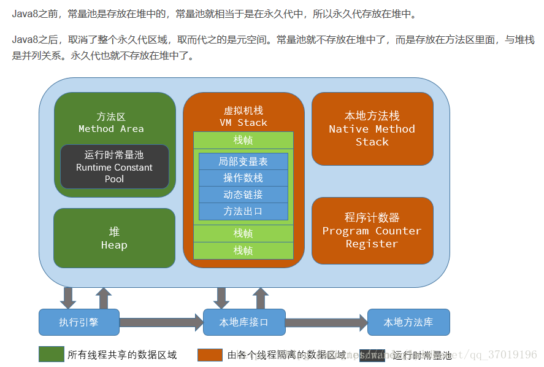
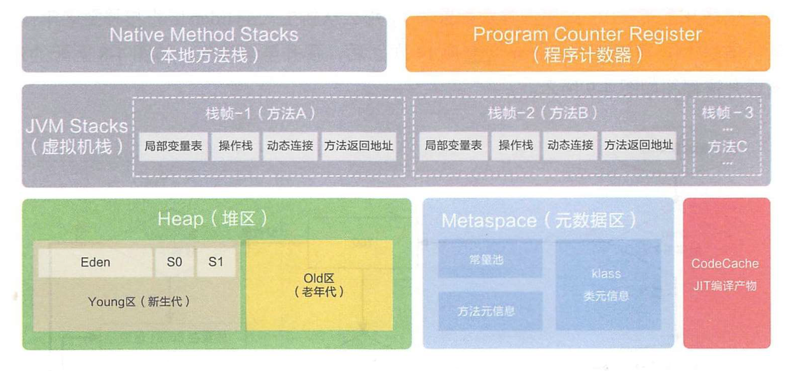
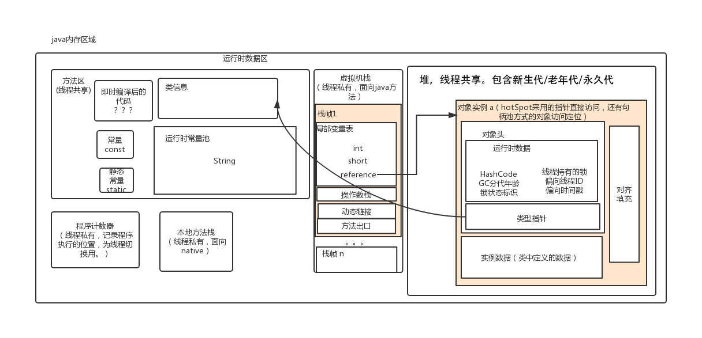

# JVM总结


# 内存模型	

**JVM内存模型：** 
**虚拟机栈**：用来放局部变量、堆区对象的引用和常量池对象的引用；但对象本身不存放在栈中，而是存放在堆（new出来的对象）或者常量池中(对象可能在常量池里)（字符串常量对象存放在常量池中。）；

**方法区**：存放类的信息；此区包含常量池（常量池用来放基本类型常量和字符串类型常量），此部分可以回收；方法区可以放用static修饰的变量，但此部分不能回收，因为方法区也叫持久带，永久带基本不参与垃圾回收；

**堆：**：存放一些new出的对象（包含成员变量）的实例，和数组。但发生[方法逃逸](https://www.cnblogs.com/rookieLearn/p/7429800.html)了就不会保存堆里面了。

关于内存模型的**图片**： 

	


# Java运行时数据区域

众所周知，Java 虚拟机有自动内存管理机制，如果出现内存泄漏和溢出方面的问题，排查错误就必须要了解虚拟机是怎样使用内存的。

下图是 JDK8 之后的 JVM 内存布局。



JDK8 之前的内存区域图如下:



> 在 HotSpot JVM 中，永久代中用于存放类和方法的元数据以及常量池，比如`Class`和`Method`。每当一个类初次被加载的时候，它的元数据都会放到永久代中。
>  永久代是有大小限制的，因此如果加载的类太多，很有可能导致永久代内存溢出，即万恶的 *java.lang.OutOfMemoryError: PermGen* ，为此我们不得不对虚拟机做调优。
>  那么，Java 8 中 PermGen 为什么被移出 HotSpot JVM 了？我总结了两个主要原因:

1. 由于 PermGen 内存经常会溢出，引发恼人的 *java.lang.OutOfMemoryError: PermGen*，因此 JVM 的开发者希望这一块内存可以更灵活地被管理，不要再经常出现这样的 OOM
2. 移除 PermGen 可以促进 HotSpot JVM 与 JRockit VM 的融合，因为 JRockit 没有永久代。
    根据上面的各种原因，PermGen 最终被移除，**方法区移至 Metaspace，字符串常量移至 Java Heap**。

# 架构


# 概念

1、JVM内存模型：
线程独占:栈,本地方法栈,程序计数器
线程共享:堆,方法区
2、栈：
又称方法栈,线程私有的,线程执行方法是都会创建一个栈阵,用来存储局部变量表,操作栈,动态链接,方法
出口等信息.调用方法时执行入栈,方法返回式执行出栈.
公众号：Java专栏
3、本地方法栈
与栈类似,也是用来保存执行方法的信息.执行Java方法是使用栈,执行Native方法时使用本地方法栈.
4、程序计数器
保存着当前线程执行的字节码位置,每个线程工作时都有独立的计数器,只为执行Java方法服务,执行
Native方法时,程序计数器为空.
5、堆
JVM内存管理最大的一块,对被线程共享,目的是存放对象的实例,几乎所欲的对象实例都会放在这里,当堆
没有可用空间时,会抛出OOM异常.根据对象的存活周期不同,JVM把对象进行分代管理,由垃圾回收器进行
垃圾的回收管理
6、方法区：
又称非堆区,用于存储已被虚拟机加载的类信息,常量,静态变量,即时编译器优化后的代码等数据.1.7的永久代和1.8的元空间都是方法区的一种实现


# 加载器


# 加载机制


# 垃圾回收机制GC

## Minor GC/Young GC、Major GC/Old GC、Full GC

JVM 在进行 GC 时，并非每次都对堆内存（新生代、老年代；方法区）区域一起回收的，大
部分时候回收的都是指新生代。
针对 HotSpot VM 的实现，它里面的 GC 按照回收区域又分为两大类：部分收集（Partial
GC），整堆收集（Full GC）

- 部分收集：不是完整收集整个 Java 堆的垃圾收集。其中又分为：
  - 目前只有 G1 GC 会有这种行为目前，只有 CMS GC 会有单独收集老年代的行为
  - 很多时候 Major GC 会和 Full GC 混合使用，需要具体分辨是老年代回收还是整堆回收
  - 新生代收集（Minor GC/Young GC）：只是新生代的垃圾收集
  - 老年代收集（Major GC/Old GC）：只是老年代的垃圾收集
  - 混合收集（Mixed GC）：收集整个新生代以及部分老年代的垃圾收集
- 整堆收集（Full GC）：收集整个 Java 堆和方法区的垃圾

## 回收对象的判断


## 垃圾回收的触发


## 垃圾回收算法


# OOM

 java.lang.OutOfMemoryError

主要类型

```text
java.lang.StackOverflowError
java.lang.OutOfMemoryError: Java heap space
java.lang.OutOfMemoryError: GC overhead limit exceeded
java.lang.OutOfMemoryError-->Metaspace
java.lang.OutOfMemoryError: Direct buffer memory
java.lang.OutOfMemoryError: unable to create new native thread
java.lang.OutOfMemoryError：Metaspace
java.lang.OutOfMemoryError: Requested array size exceeds VM limit
java.lang.OutOfMemoryError: Out of swap space
java.lang.OutOfMemoryError：Kill process or sacrifice child
```


