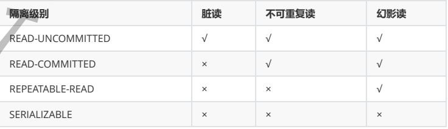
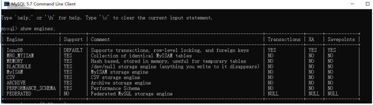

# 基础

## DDL、DQL、DML、DCL

```text
1：数据定义语言（DDL）
用于创建、修改、和删除数据库内的数据结构，如：1：创建和删除数据库(CREATE DATABASE || DROP DATABASE)；2：创建、修改、重命名、删除表(CREATE TABLE || ALTER TABLE|| RENAME TABLE||DROP TABLE)；3：创建和删除索引(CREATEINDEX || DROP INDEX)
2：数据查询语言（DQL）
从数据库中的一个或多个表中查询数据(SELECT)
3：数据操作语言（DML）
修改数据库中的数据，包括插入(INSERT)、更新(UPDATE)和删除(DELETE)
4：数据控制语言（DCL）
用于对数据库的访问，如：1：给用户授予访问权限（GRANT）;2：取消用户访问权限（REMOKE）
```

## SQL 的 select 语句完整的执行顺序

```text
SQL Select 语句完整的执行顺序：
1、from 子句组装来自不同数据源的数据；
2、where 子句基于指定的条件对记录行进行筛选；
3、group by 子句将数据划分为多个分组；
4、使用聚集函数进行计算；
5、使用 having 子句筛选分组；
6、计算所有的表达式；
7、select 的字段；
8、使用 order by 对结果集进行排序。


SQL 语言不同于其他编程语言的最明显特征是处理代码的顺序。在大多数据库语言中，代码按编码顺序被处
理。但在 SQL 语句中，第一个被处理的子句式 FROM，而不是第一出现的 SELECT。SQL 查询处理的步骤序号：
(1) FROM <left_table>
(2) <join_type> JOIN <right_table>
(3) ON <join_condition>
(4) WHERE <where_condition>
(5) GROUP BY <group_by_list>
(6) WITH {CUBE | ROLLUP}
(7) HAVING <having_condition>
(8) SELECT
(9) DISTINCT
(9) ORDER BY <order_by_list>
(10) <TOP_specification> <select_list>
以上每个步骤都会产生一个虚拟表，该虚拟表被用作下一个步骤的输入。这些虚拟表对调用者(客户端应
用程序或者外部查询)不可用。只有最后一步生成的表才会会给调用者。如果没有在查询中指定某一个子句，
将跳过相应的步骤。
逻辑查询处理阶段简介：
1、 FROM：对 FROM 子句中的前两个表执行笛卡尔积(交叉联接)，生成虚拟表 VT1。
2、 ON：对 VT1 应用 ON 筛选器，只有那些使为真才被插入到 TV2。
3、 OUTER (JOIN):如果指定了 OUTER JOIN(相对于 CROSS JOIN 或 INNER JOIN)，保留表中未找到
匹配的行将作为外部行添加到 VT2，生成 TV3。如果 FROM 子句包含两个以上的表，则对上一个联接生成的
结果表和下一个表重复执行步骤 1 到步骤 3，直到处理完所有的表位置。
4、 WHERE：对 TV3 应用 WHERE 筛选器，只有使为 true 的行才插入 TV4。
5、 GROUP BY：按 GROUP BY 子句中的列列表对 TV4 中的行进行分组，生成 TV5。
6、 CUTE|ROLLUP：把超组插入 VT5，生成 VT6。
7、 HAVING：对 VT6 应用 HAVING 筛选器，只有使为 true 的组插入到 VT7。
8、 SELECT：处理 SELECT 列表，产生 VT8。
9、 DISTINCT：将重复的行从 VT8 中删除，产品 VT9。
10、 ORDER BY：将 VT9 中的行按 ORDER BY 子句中的列列表顺序，生成一个游标(VC10)。
11、 TOP：从 VC10 的开始处选择指定数量或比例的行，生成表 TV11，并返回给调用者。
where 子句中的条件书写顺序

```


##  SQL 之连接查询（左连接和右连接的区别）

````text
外连接：
左连接（左外连接）：以左表作为基准进行查询，左表数据会全部显示出来，右表如果和左表匹配的
数据则显示相应字段的数据，如果不匹配则显示为 null。
右连接（右外连接）：以右表作为基准进行查询，右表数据会全部显示出来，左表如果和右表匹配的
数据则显示相应字段的数据，如果不匹配则显示为 null。
全连接：先以左表进行左外连接，再以右表进行右外连接。
````

## 数据库的三范式是什么

```text
第一范式：列不可再分
第二范式：行可以唯一区分，主键约束
第三范式：表的非主属性不能依赖与其他表的非主属性 外键约束
且三大范式是一级一级依赖的，第二范式建立在第一范式上，第三范式建立第一第二范式上。
```


## drop、delete与truncate的区别

SQL中的drop、delete、truncate都表示删除，但是三者有一些差别
delete和truncate只删除表的数据不删除表的结构
速度,一般来说: drop> truncate >delete 
delete语句是dml,这个操作会放到rollback segement中,事务提交之后才生效;
如果有相应的trigger,执行的时候将被触发. truncate,drop是ddl, 操作立即生效,原数据不放到rollback
segment中,不能回滚. 操作不触发trigger.


# 事务

## ACID

- A（atomicity）[ˌætəˈmɪsəti]：原子性
- C（consistency）[kənˈsɪstənsi] ：一致性
- I（isolation） [ˌaɪsəˈleɪʃn]：隔离性
- D（durability）[dərəˈbɪlɪti]：持久性

原子性：一个事务必须被视为一个不可分割的最小单位，要不全部提交成功，要么全部失败回滚。
一致性：数据库总是从一个一致性的状态转换到另外一个一致性状态，不会部分数据状态改变了部分状态没有改变。
隔离性：通常来说，一个事务所做的修改在最终提交之前，对其他事务是不可见的。这个和数据库的隔离级别有关，所以只能通常来说。
持久性：一旦事务提交，则其所做的修改会被永久保存到数据库中。

## 事务隔离级别有哪些?MySQL的默认隔离级别是?

SQL 标准定义了四个隔离级别：

* READ-UNCOMMITTED(读取未提交)： 最低的隔离级别，允许读取尚未提交的数据变更，可能会
  导致脏读、幻读或不可重复读。
* READ-COMMITTED(读取已提交)： 允许读取并发事务已经提交的数据，可以阻止脏读，但是幻
  读或不可重复读仍有可能发生。
* REPEATABLE-READ(可重复读)： 对同一字段的多次读取结果都是一致的，除非数据是被本身事务
  自己所修改，可以阻止脏读和不可重复读，但幻读仍有可能发生。
* SERIALIZABLE(可串行化)： 最高的隔离级别，完全服从ACID的隔离级别。所有的事务依次逐个执
  行，这样事务之间就完全不可能产生干扰，也就是说，该级别可以防止脏读、不可重复读以及幻
  读。



MySQL InnoDB 存储引擎的默认支持的隔离级别是 REPEATABLE-READ（可重读）。


## 并发事务带来哪些问题?

在典型的应用程序中，多个事务并发运行，经常会操作相同的数据来完成各自的任务（多个用户对同一
数据进行操作）。并发虽然是必须的，但可能会导致以下的问题。

* 脏读（Dirty read）: 当一个事务正在访问数据并且对数据进行了修改，而这种修改还没有提交到
  数据库中，这时另外一个事务也访问了这个数据，然后使用了这个数据。因为这个数据是还没有提
  交的数据，那么另外一个事务读到的这个数据是“脏数据”，依据“脏数据”所做的操作可能是不正确
  的。

* 丢失修改（Lost to modify）: 指在一个事务读取一个数据时，另外一个事务也访问了该数据，那
  么在第一个事务中修改了这个数据后，第二个事务也修改了这个数据。这样第一个事务内的修改结
  果就被丢失，因此称为丢失修改。 例如：事务1读取某表中的数据A=20，事务2也读取A=20，事
  务1修改A=A-1，事务2也修改A=A-1，最终结果A=19，事务1的修改被丢失。

* 不可重复读（Unrepeatableread）: 指在一个事务内多次读同一数据。在这个事务还没有结束
  时，另一个事务也访问该数据。那么，在第一个事务中的两次读数据之间，由于第二个事务的修改
  导致第一个事务两次读取的数据可能不太一样。这就发生了在一个事务内两次读到的数据是不一样
  的情况，因此称为不可重复读。

* 幻读（Phantom read）: 幻读与不可重复读类似。它发生在一个事务（T1）读取了几行数据，接
  着另一个并发事务（T2）插入了一些数据时。在随后的查询中，第一个事务（T1）就会发现多了
  一些原本不存在的记录，就好像发生了幻觉一样，所以称为幻读。

  

不可重复读和幻读区别：
不可重复读的重点是修改比如多次读取一条记录发现其中某些列的值被修改，幻读的重点在于新增或者
删除比如多次读取一条记录发现记录增多或减少了

# 引擎


```text
show engines;
```




mysql常用引擎包括：MYISAM、Innodb、Memory、MERGE

MYISAM：全表锁，拥有较高的执行速度，不支持事务，不支持外键，并发性能差，占用空间相对
较小，对事务完整性没有要求，以select、insert为主的应用基本上可以使用这引擎
Innodb:行级锁，提供了具有提交、回滚和崩溃回复能力的事务安全，支持自动增长列，支持外键
约束，并发能力强，占用空间是MYISAM的2.5倍，处理效率相对会差一些
Memory:全表锁，存储在内容中，速度快，但会占用和数据量成正比的内存空间且数据在mysql重
启时会丢失，默认使用HASH索引，检索效率非常高，但不适用于精确查找，主要用于那些内容变
化不频繁的代码表
MERGE：是一组MYISAM表的组合


## InnoDB与MyISAM的区别

```text
1. InnoDB支持事务，MyISAM不支持，对于InnoDB每一条SQL语言都默认封装成事务，自动提交，
   这样会影响速度，所以最好把多条SQL语言放在begin和commit之间，组成一个事务；
2. InnoDB支持外键，而MyISAM不支持。对一个包含外键的InnoDB表转为MYISAM会失败；
3. InnoDB是聚集索引，数据文件是和索引绑在一起的，必须要有主键，通过主键索引效率很高。但
   是辅助索引需要两次查询，先查询到主键，然后再通过主键查询到数据。因此，主键不应该过大，
   因为主键太大，其他索引也都会很大。而MyISAM是非聚集索引，数据文件是分离的，索引保存的
   是数据文件的指针。主键索引和辅助索引是独立的。
4. InnoDB不保存表的具体行数，执行select count(*) from table时需要全表扫描。而MyISAM用一
   个变量保存了整个表的行数，执行上述语句时只需要读出该变量即可，速度很快；
5. Innodb不支持全文索引，而MyISAM支持全文索引，查询效率上MyISAM要高；
```

## 索引

### 1.什么是索引

```text
MySQL 官方对索引的定义为：索引(Index)是帮助 MySQL 高效获取数据的数据结构
本质上是一种数据结构
```


### 2.索引为什么能提高查询效率

```text
通过索引的结构最大化的减少数据库的 IO 次数

其实就是一句话，通过索引的结构最大化的减少数据库的 IO 次数，毕竟，一次 IO 的时间真的是太久了。。。
```


### 3.索引的种类

```text
B+Tree索引、BTree索引、哈希索引

InnoDB:B+Tree索引
```


### 4.索引的优缺点

```text
优点
1.索引大大减小了服务器需要扫描的数据量
2.索引可以帮助服务器避免排序和临时表
3.索引可以将随机IO变成顺序IO
4.索引对于InnoDB（对索引支持行级锁）非常重要，因为它可以让查询锁更少的元组。
在MySQL5.1和更新的版本中，InnoDB可以在服务器端过滤掉行后就释放锁，但在早期的MySQL版本中，InnoDB直到事务提交时才会解锁。对不需要的元组的加锁，会增加锁的开销，降低并发性。 InnoDB仅对需要访问的元组加锁，而索引能够减少InnoDB访问的元组数。但是只有在存储引擎层过滤掉那些不需要的数据才能达到这种目的。一旦索引不允许InnoDB那样做（即索引达不到过滤的目的），MySQL服务器只能对InnoDB返回的数据进行WHERE操作，此时，已经无法避免对那些元组加锁了。如果查询不能使用索引，MySQL会进行全表扫描，并锁住每一个元组，不管是否真正需要。
关于InnoDB、索引和锁：InnoDB在二级索引上使用共享锁（读锁），但访问主键索引需要排他锁（写锁）

缺点
1.虽然索引大大提高了查询速度，同时却会降低更新表的速度，如对表进行INSERT、UPDATE和DELETE。因为更新表时，MySQL不仅要保存数据，还要保存索引文件。
2.建立索引会占用磁盘空间的索引文件。一般情况这个问题不太严重，但如果你在一个大表上创建了多种组合索引，索引文件的会膨胀很快。
3.如果某个数据列包含许多重复的内容，为它建立索引就没有太大的实际效果。
4.对于非常小的表，大部分情况下简单的全表扫描更高效；
5.索引只是提高效率的一个因素，如果你的MySQL有大数据量的表，就需要花时间研究建立最优秀的索引，或优化查询语句。

因此应该只为最经常查询和最经常排序的数据列建立索引。

MySQL里同一个数据表里的索引总数限制为16个。
```

索引建立的原则

```text
1.在经常需要搜索的列上建立索引，可以加快搜索的速度。
2.在作为主键的列上创建索引，强制该列的唯一性，并组织表中数据的排列结构。
3.在经常使用表连接的列上创建索引，这些列主要是一些外键，可以加快表连接的速度。
4.在经常需要根据范围进行搜索的列上创建索引，因为索引已经排序，所以其指定的范围是连续的。
5.在经常需要排序的列上创建索引，因为索引已经排序，所以查询时可以利用索引的排序，加快排序查询。
6.在经常使用 WHERE 子句的列上创建索引，加快条件的判断速度。
```


### ex：计算机层面加载下一个索引数据的流程

```text
相关磁盘IO和预读
先说一下磁盘 IO，磁盘读取数据靠的是机械运动，每一次读取数据需要寻道、寻点、拷贝到内存三步操作。
寻道时间是磁臂移动到指定磁道所需要的时间，一般在 5ms 以下；
寻点是从磁道中找到数据存在的那个点，平均时间是半圈时间，如果是一个 7200 转/min 的磁盘，寻点时间平均是 600000/7200/2=4.17ms；
拷贝到内存的时间很快，和前面两个时间比起来可以忽略不计，所以一次 IO 的时间平均是在 9ms 左右。
听起来很快，但数据库百万级别的数据过一遍就达到了 9000s，显然就是灾难级别的了。

考虑到磁盘 IO 是非常高昂的操作。
计算机操作系统做了预读的优化，当一次 IO 时，不光把当前磁盘地址的数据，而是把相邻的数据也都读取到内存缓冲区内，因为当计算机访问一个地址的数据的时候，与其相邻的数据也会很快被访问到。
每一次 IO 读取的数据我们称之为一页(page)，具体一页有多大数据跟操作系统有关，一般为 4k 或 8k，也就是我们读取一页内的数据时候，实际上才发生了一次 IO。
（突然想到个我刚毕业被问过的问题，在 64 位的操作系统中，Java 中的 int 类型占几个字节？最大是多少？为什么？）
那我们想要优化数据库查询，就要尽量减少磁盘的 IO 操作，所以就出现了索引。
```


# 触发器


# 存储过程、存储函数


# 优化

## 语句优化

```TEXT
1、查询语句中不要使用select *
2、尽量减少子查询，使用关联查询（left join,right join,inner join）替代
3、减少使用IN或者NOT IN ,使用exists，not exists或者关联查询语句替代
4、or 的查询尽量用 union或者union all 代替(在确认没有重复数据或者不用剔除重复数据时，union
all会更好)
5、应尽量避免在 where 子句中使用!=或<>操作符，否则将引擎放弃使用索引而进行全表扫描。
6、应尽量避免在 where 子句中对字段进行 null 值判断，否则将导致引擎放弃使用索引而进行全表扫
描，如： select id from t where num is null 可以在num上设置默认值0，确保表中num列没有null
值，然后这样查询： select id from t where num=0
```


## 大表如何优化？

当MySQL单表记录数过大时，数据库的CRUD性能会明显下降，一些常见的优化措施如下：

1. 限定数据的范围
务必禁止不带任何限制数据范围条件的查询语句。比如：我们当用户在查询订单历史的时候，我们可以
控制在一个月的范围内；
2. 读/写分离
经典的数据库拆分方案，主库负责写，从库负责读；
3. 垂直分区
根据数据库里面数据表的相关性进行拆分。 例如，用户表中既有用户的登录信息又有用户的基本信息，
可以将用户表拆分成两个单独的表，甚至放到单独的库做分库。
简单来说垂直拆分是指数据表列的拆分，把一张列比较多的表拆分为多张表。
4. 水平分区
  保持数据表结构不变，通过某种策略存储数据分片。这样每一片数据分散到不同的表或者库中，达到了
  分布式的目的。 水平拆分可以支撑非常大的数据量。
  水平拆分是指数据表行的拆分，表的行数超过200万行时，就会变慢，这时可以把一张的表的数据拆成
  多张表来存放。举个例子：我们可以将用户信息表拆分成多个用户信息表，这样就可以避免单一表数据
  量过大对性能造成影响。

## 分库分表之后,id 主键如何处理？

因为要是分成多个表之后，每个表都是从 1 开始累加，这样是不对的，我们需要一个全局唯一的 id 来
支持。
生成全局 id 有下面这几种方式：
UUID：不适合作为主键，因为太长了，并且无序不可读，查询效率低。比较适合用于生成唯一的
名字的标示比如文件的名字。
数据库自增 id : 两台数据库分别设置不同步长，生成不重复ID的策略来实现高可用。这种方式生成
的 id 有序，但是需要独立部署数据库实例，成本高，还会有性能瓶颈。
利用 redis 生成 id : 性能比较好，灵活方便，不依赖于数据库。但是，引入了新的组件造成系统更
加复杂，可用性降低，编码更加复杂，增加了系统成本。
Twitter的snowflake算法 ：Github 地址：https://github.com/twitter-archive/snowflake。
美团的Leaf分布式ID生成系统 ：Leaf 是美团开源的分布式ID生成器，能保证全局唯一性、趋势递
增、单调递增、信息安全，里面也提到了几种分布式方案的对比，但也需要依赖关系数据库、
Zookeeper等中间件。感觉还不错。美团技术团队的一篇文章：https://tech.meituan.com/2017/
04/21/mt-leaf.html 。