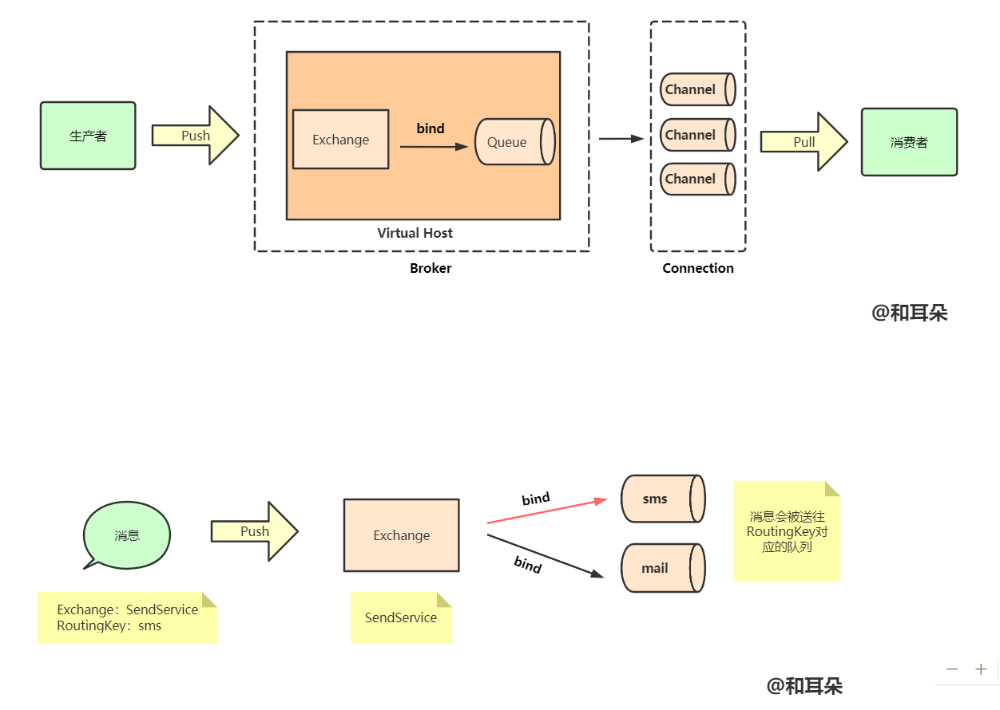

# 实现原理


# 架构，涉及的设计模式




# 消息分发机制


# 消息确认机制


# 应用场景


# 优缺点


# 工作模式


# 核心概念

```text
RabbitMQ Server： 也叫broker server，它是一种传输服务。 他的角色就是维护一条
从Producer到Consumer的路线，保证数据能够按照指定的方式进行传输。

Producer： 消息生产者，如图A、B、C，数据的发送方。消息生产者连接RabbitMQ服
务器然后将消息投递到Exchange。

Consumer：消息消费者，如图1、2、3，数据的接收方。消息消费者订阅队列，
RabbitMQ将Queue中的消息发送到消息消费者。

Exchange：生产者将消息发送到Exchange（交换器），由Exchange将消息路由到一个
或多个Queue中（或者丢弃）。Exchange并不存储消息。RabbitMQ中的Exchange有
direct、fanout、topic、headers四种类型，每种类型对应不同的路由规则。
直连交换机-direct  ：RountingKey = BindingKey
主题交换机-topic   : 匹配模式，如 ： *.lga.*
广播交换机-fanout  : 广播模式

Queue：（队列）是RabbitMQ的内部对象，用于存储消息。消息消费者就是通过订阅
队列来获取消息的，RabbitMQ中的消息都只能存储在Queue中，生产者生产消息并最终
投递到Queue中，消费者可以从Queue中获取消息并消费。多个消费者可以订阅同一个
Queue，这时Queue中的消息会被平均分摊给多个消费者进行处理，而不是每个消费者
都收到所有的消息并处理。

RoutingKey：生产者在将消息发送给Exchange的时候，一般会指定一个routing key，
来指定这个消息的路由规则，而这个routing key需要与Exchange Type及binding key联
合使用才能最终生效。在Exchange Type与binding key固定的情况下（在正常使用时一
般这些内容都是固定配置好的），我们的生产者就可以在发送消息给Exchange时，通过
指定routing key来决定消息流向哪里。RabbitMQ为routing key设定的长度限制为255
bytes。

Connection： （连接）：Producer和Consumer都是通过TCP连接到RabbitMQ Server
的。以后我们可以看到，程序的起始处就是建立这个TCP连接。

Channels： （信道）：它建立在上述的TCP连接中。数据流动都是在Channel中进行
的。也就是说，一般情况是程序起始建立TCP连接，第二步就是建立这个Channel。

VirtualHost：权限控制的基本单位，一个VirtualHost里面有若干Exchange和
MessageQueue，以及指定被哪些user使用
```


