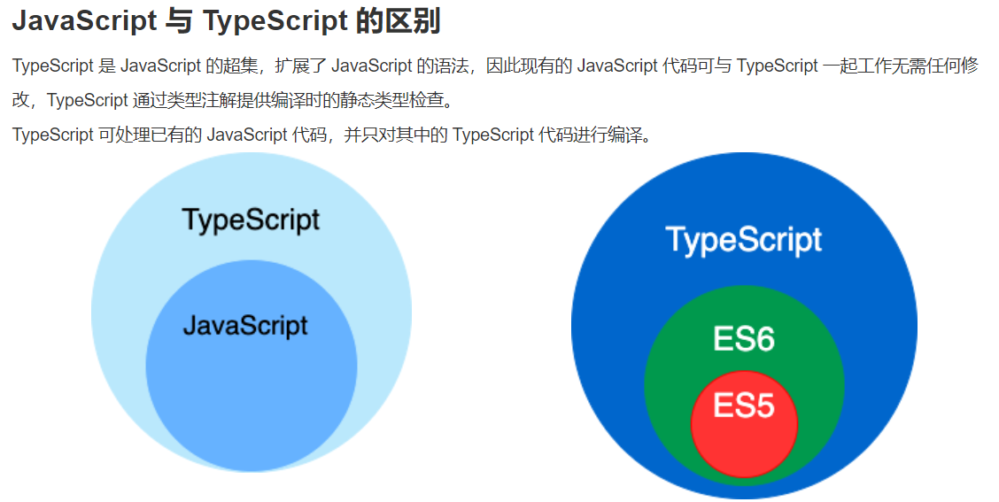

# Typescript

# 简介

TypeScript 是 JavaScript 的一个超集（js,ES5,ES6）

TypeScript 设计目标是开发大型应用，它可以编译成纯 JavaScript，编译出来的 JavaScript 可以运行在任何浏览器上。

ypeScript 是一种给 JavaScript 添加特性的语言扩展。增加的功能包括：

- 类型批注和编译时类型检查
- 类型推断
- 类型擦除
- 接口
- 枚举
- Mixin
- 泛型编程
- 名字空间
- 元组
- Await

以下功能是从 ECMA 2015 反向移植而来：

- 类
- 模块
- lambda 函数的箭头语法
- 可选参数以及默认参数




# 基础语法

TypeScript 程序由以下几个部分组成：

- 模块
- 函数
- 变量
- 语句和表达式
- 注释


# 数据类型

## 所有数据类型

TypeScript 包含的数据类型如下表:

| 数据类型   | 关键字    | 描述                                                         |
| :--------- | :-------- | :----------------------------------------------------------- |
| 任意类型   | any       | 声明为 any 的变量可以赋予任意类型的值。                      |
| 数字类型   | number    | 双精度 64 位浮点值。它可以用来表示整数和分数。`let binaryLiteral: number = 0b1010; // 二进制 let octalLiteral: number = 0o744;    // 八进制 let decLiteral: number = 6;    // 十进制 let hexLiteral: number = 0xf00d;    // 十六进制` |
| 字符串类型 | string    | 一个字符系列，使用单引号（**'**）或双引号（**"**）来表示字符串类型。反引号（**`**）来定义多行文本和内嵌表达式。`let name: string = "Runoob"; let years: number = 5; let words: string = `您好，今年是 ${ name } 发布 ${ years + 1} 周年`;` |
| 布尔类型   | boolean   | 表示逻辑值：true 和 false。`let flag: boolean = true;`       |
| 数组类型   | 无        | 声明变量为数组。`// 在元素类型后面加上[] let arr: number[] = [1, 2]; // 或者使用数组泛型 let arr: Array<number> = [1, 2];` |
| 元组       | 无        | 元组类型用来表示已知元素数量和类型的数组，各元素的类型不必相同，对应位置的类型需要相同。`let x: [string, number]; x = ['Runoob', 1];    // 运行正常 x = [1, 'Runoob'];    // 报错 console.log(x[0]);    // 输出 Runoob` |
| 枚举       | enum      | 枚举类型用于定义数值集合。`enum Color {Red, Green, Blue}; let c: Color = Color.Blue; console.log(c);    // 输出 2` |
| void       | void      | 用于标识方法返回值的类型，表示该方法没有返回值。`function hello(): void {    alert("Hello Runoob"); }` |
| null       | null      | 表示对象值缺失。                                             |
| undefined  | undefined | 用于初始化变量为一个未定义的值                               |
| never      | never     | never 是其它类型（包括 null 和 undefined）的子类型，代表从不会出现的值。 |

**注意：**TypeScript 和 JavaScript 没有整数类型。

## Any 类型

任意值是 TypeScript 针对编程时类型不明确的变量使用的一种数据类型，它常用于以下三种情况。

1、变量的值会动态改变时，比如来自用户的输入，任意值类型可以让这些变量跳过编译阶段的类型检查，示例代码如下：

```
let x: any = 1;    // 数字类型
x = 'I am who I am';    // 字符串类型
x = false;    // 布尔类型
```

改写现有代码时，任意值允许在编译时可选择地包含或移除类型检查，示例代码如下：

```
let x: any = 4;
x.ifItExists();    // 正确，ifItExists方法在运行时可能存在，但这里并不会检查
x.toFixed();    // 正确
```

定义存储各种类型数据的数组时，示例代码如下：

```
let arrayList: any[] = [1, false, 'fine'];
arrayList[1] = 100;
```

------

## Null 和 Undefined

### null

在 JavaScript 中 null 表示 "什么都没有"。

null是一个只有一个值的特殊类型。表示一个空对象引用。

用 typeof 检测 null 返回是 object。

### undefined

在 JavaScript 中, undefined 是一个没有设置值的变量。

typeof 一个没有值的变量会返回 undefined。

Null 和 Undefined 是其他任何类型（包括 void）的子类型，可以赋值给其它类型，如数字类型，此时，赋值后的类型会变成 null 或 undefined。而在TypeScript中启用严格的空校验（--strictNullChecks）特性，就可以使得null 和 undefined 只能被赋值给 void 或本身对应的类型，示例代码如下：

```
// 启用 --strictNullChecks
let x: number;
x = 1; // 运行正确
x = undefined;    // 运行错误
x = null;    // 运行错误
```

上面的例子中变量 x 只能是数字类型。如果一个类型可能出现 null 或 undefined， 可以用 | 来支持多种类型，示例代码如下：

```
// 启用 --strictNullChecks
let x: number | null | undefined;
x = 1; // 运行正确
x = undefined;    // 运行正确
x = null;    // 运行正确
```

更多内容可以查看：[JavaScript typeof, null, 和 undefined](https://www.runoob.com/js/js-typeof.html)

------

## never 类型

never 是其它类型（包括 null 和 undefined）的子类型，代表从不会出现的值。这意味着声明为 never 类型的变量只能被 never 类型所赋值，在函数中它通常表现为抛出异常或无法执行到终止点（例如无限循环），示例代码如下：

```
let x: never;
let y: number;

// 运行错误，数字类型不能转为 never 类型
x = 123;

// 运行正确，never 类型可以赋值给 never类型
x = (()=>{ throw new Error('exception')})();

// 运行正确，never 类型可以赋值给 数字类型
y = (()=>{ throw new Error('exception')})();

// 返回值为 never 的函数可以是抛出异常的情况
function error(message: string): never {
    throw new Error(message);
}

// 返回值为 never 的函数可以是无法被执行到的终止点的情况
function loop(): never {
    while (true) {}
}
```


# 变量

变量是一种使用方便的占位符，用于引用计算机内存地址。

我们可以把变量看做存储数据的容器。

TypeScript 变量的命名规则：

- 变量名称可以包含数字和字母。
- 除了下划线 **_** 和美元 **$** 符号外，不能包含其他特殊字符，包括空格。
- 变量名不能以数字开头。

```typescript
1.
声明变量的类型及初始值：
var [变量名] : [类型] = 值; 
如：var uname:string = "Runoob";
2.
声明变量的类型，但没有初始值，变量值会设置为 undefined：
var [变量名] : [类型];
var uname:string;	
3.
声明变量并初始值，但不设置类型，该变量可以是任意类型：
var [变量名] = 值;
var uname = "Runoob";
4.
声明变量没有设置类型和初始值，类型可以是任意类型，默认初始值为 undefined：
var [变量名];
var uname;

```

## 类型断言（Type Assertion）

类型断言可以用来手动指定一个值的类型，即允许变量从一种类型更改为另一种类型。

当 S 类型是 T 类型的子集，或者 T 类型是 S 类型的子集时，S 能被成功断言成 T。这是为了在进行类型断言时提供额外的安全性，完全毫无根据的断言是危险的，如果你想这么做，你可以使用 any。

它之所以不被称为**类型转换**，是因为转换通常意味着某种运行时的支持。但是，类型断言纯粹是一个编译时语法，同时，它也是一种为编译器提供关于如何分析代码的方法。

语法格式：

```typescript
1.
<类型>值
2.
值 as 类型

实例：
var str = '1' 
var str2:number = <number> <any> str   //str、str2 是 string 类型
console.log(str2)

编译后，以上代码会生成如下 JavaScript 代码：
var str = '1';
var str2 = str;  //str、str2 是 string 类型
console.log(str2);
```

## 类型推断

当类型没有给出时，TypeScript 编译器利用类型推断来推断类型。

如果由于缺乏声明而不能推断出类型，那么它的类型被视作默认的动态 any 类型。

```typescript
var num = 2;    // 类型推断为 number
console.log("num 变量的值为 "+num); 
num = "12";    // 编译错误
console.log(num);
```

- 第一行代码声明了变量 num 并=设置初始值为 2。 注意变量声明没有指定类型。因此，程序使用类型推断来确定变量的数据类型，第一次赋值为 2，**num** 设置为 number 类型。

- 第三行代码，当我们再次为变量设置字符串类型的值时，这时编译会错误。因为变量已经设置为了 number 类型。

  ```
  error TS2322: Type '"12"' is not assignable to type 'number'.
  ```

## 变量作用域

变量作用域指定了变量定义的位置。

程序中变量的可用性由变量作用域决定。

TypeScript 有以下几种作用域：

- **全局作用域** − 全局变量定义在程序结构的外部，它可以在你代码的任何位置使用。
- **类作用域** − 这个变量也可以称为 **字段**。类变量声明在一个类里头，但在类的方法外面。 该变量可以通过类的对象来访问。类变量也可以是静态的，静态的变量可以通过类名直接访问。
- **局部作用域** − 局部变量，局部变量只能在声明它的一个代码块（如：方法）中使用。

以下实例说明了三种作用域的使用：

```typescript
var global_num = 12          // 全局变量
class Numbers { 
   num_val = 13;             // 实例变量
   static sval = 10;         // 静态变量
   
   storeNum():void { 
      var local_num = 14;    // 局部变量
   } 
} 
console.log("全局变量为: "+global_num)  
console.log(Numbers.sval)   // 静态变量
var obj = new Numbers(); 
console.log("实例变量: "+obj.num_val)
```


以上代码使用 tsc 命令编译为 JavaScript 代码为：

```typescript
var global_num = 12; // 全局变量
var Numbers = /** @class */ (function () {
    function Numbers() {
        this.num_val = 13; // 实例变量
    }
    Numbers.prototype.storeNum = function () {
        var local_num = 14; // 局部变量
    };
    Numbers.sval = 10; // 静态变量
    return Numbers;
}());
console.log("全局变量为: " + global_num);
console.log(Numbers.sval); // 静态变量
var obj = new Numbers();
console.log("实例变量: " + obj.num_val);
```


执行以上 JavaScript 代码，输出结果为：

```
全局变量为: 12
10
实例变量: 13
```

如果我们在方法外部调用局部变量 local_num，会报错：

```
error TS2322: Could not find symbol 'local_num'.
```


# 命名空间

```typescript
/*
命名空间:

    在代码量较大的情况下，为了避免各种变量命名相冲突，可将相似功能的函数、类、接口等放置到命名空间内

    同Java的包、.Net的命名空间一样，TypeScript的命名空间可以将代码包裹起来，只对外暴露需要在外部访问的对象。命名空间内的对象通过export关键字对外暴露。


命名空间和模块的区别：

    命名空间：内部模块，主要用于组织代码，避免命名冲突。

    模    块：ts的外部模块的简称，侧重代码的复用，一个模块里可能会有多个命名空间。

*/


namespace A{
    interface Animal {
        name: string;
        eat(): void;
    }
    export class Dog implements Animal {
        name: string;
        constructor(theName: string) {
            this.name = theName;
        }

        eat() {
            console.log(`${this.name} 在吃狗粮。`);
        }
    }

    export class Cat implements Animal {
        name: string;
        constructor(theName: string) {
            this.name = theName;
        }

        eat() {
            console.log(`${this.name} 吃猫粮。`);
        }
    }   

}


namespace B{
    interface Animal {
        name: string;
        eat(): void;
    }
    export class Dog implements Animal {
        name: string;
        constructor(theName: string) {
            this.name = theName;
        }

        eat() {
            console.log(`${this.name} 在吃狗粮。`);
        }
    }

    export class Cat implements Animal {
        name: string;
        constructor(theName: string) {
            this.name = theName;
        }

        eat() {
            console.log(`${this.name} 在吃猫粮。`);
        }
    }   

}


var c=new B.Cat('小花');

c.eat();

    
    /*
命名空间:

    在代码量较大的情况下，为了避免各种变量命名相冲突，可将相似功能的函数、类、接口等放置到命名空间内

    同Java的包、.Net的命名空间一样，TypeScript的命名空间可以将代码包裹起来，只对外暴露需要在外部访问的对象。命名空间内的对象通过export关键字对外暴露。


命名空间和模块的区别：

    命名空间：内部模块，主要用于组织代码，避免命名冲突。

    模    块：ts的外部模块的简称，侧重代码的复用，一个模块里可能会有多个命名空间。

*/

import {A,B} from './modules/animal';


var d=new A.Dog('小黑');
d.eat();


var dog=new B.Dog('小花');
dog.eat();

```


# 函数


# 类


# 接口


# 装饰器

```
/*
    装饰器:装饰器是一种特殊类型的声明，它能够被附加到类声明，方法，属性或参数上，可以修改类的行为。


    通俗的讲装饰器就是一个方法，可以注入到类、方法、属性参数上来扩展类、属性、方法、参数的功能。
    

    常见的装饰器有：类装饰器、属性装饰器、方法装饰器、参数装饰器


    装饰器的写法：普通装饰器（无法传参） 、 装饰器工厂（可传参）


    装饰器是过去几年中js最大的成就之一，已是Es7的标准特性之一


*/

//1、类装饰器：类装饰器在类声明之前被声明（紧靠着类声明）。 类装饰器应用于类构造函数，可以用来监视，修改或替换类定义。 传入一个参数


//1.1 类装饰器:普通装饰器（无法传参）
    /*
        function logClass(params:any){

            console.log(params);
            // params 就是当前类
            params.prototype.apiUrl='动态扩展的属性';
            params.prototype.run=function(){
                console.log('我是一个run方法');
            }

        }

        @logClass
        class HttpClient{
            constructor(){
            }
            getData(){

            }
        }
        var http:any=new HttpClient();
        console.log(http.apiUrl);
        http.run();
    */


//1.2 类装饰器:装饰器工厂（可传参）

   
    
        
       /*
        function logClass(params:string){
            return function(target:any){
                console.log(target);
                console.log(params);
                target.prototype.apiUrl=params;
            }
        }

        @logClass('http://www.itying.com/api')
        class HttpClient{
            constructor(){
            }

            getData(){

            }
        }

        var http:any=new HttpClient();
        console.log(http.apiUrl);
       
       */  


/*
    
1、类装饰器 

     下面是一个重载构造函数的例子。

     类装饰器表达式会在运行时当作函数被调用，类的构造函数作为其唯一的参数。

     如果类装饰器返回一个值，它会使用提供的构造函数来替换类的声明。
*/


        /*
        function logClass(target:any){
            console.log(target);
            return class extends target{
                apiUrl:any='我是修改后的数据';
                getData(){
                    this.apiUrl=this.apiUrl+'----';
                    console.log(this.apiUrl);
                }
            }
        }


        @logClass
        class HttpClient{
            public apiUrl:string | undefined;
            constructor(){
                this.apiUrl='我是构造函数里面的apiUrl';
            }
            getData(){
                console.log(this.apiUrl);
            }
        }

        var http=new HttpClient();
        http.getData();

        */


/*
   2、属性装饰器

        属性装饰器表达式会在运行时当作函数被调用，传入下列2个参数：
            1、对于静态成员来说是类的构造函数，对于实例成员是类的原型对象。
            2、成员的名字。

*/


/*
    //类装饰器
        function logClass(params:string){
            return function(target:any){
                // console.log(target);
                // console.log(params);       
                
            }
        }

    //属性装饰器

        function logProperty(params:any){
            return function(target:any,attr:any){
                console.log(target);
                console.log(attr);
                target[attr]=params;
            }
        }
        @logClass('xxxx')
        class HttpClient{
            @logProperty('http://itying.com')
            public url:any |undefined;
            constructor(){
            }
            getData(){
                console.log(this.url);
            }
        }
        var http=new HttpClient();
        http.getData();
*/


/*
    3、方法装饰器
        它会被应用到方法的 属性描述符上，可以用来监视，修改或者替换方法定义。

        方法装饰会在运行时传入下列3个参数：
            1、对于静态成员来说是类的构造函数，对于实例成员是类的原型对象。
            2、成员的名字。
            3、成员的属性描述符。

*/   
    


/*

    //方法装饰器一

    function get(params:any){
        return function(target:any,methodName:any,desc:any){
            console.log(target);
            console.log(methodName);
            console.log(desc);
            target.apiUrl='xxxx';
            target.run=function(){
                console.log('run');
            }
        }
    }

    class HttpClient{  
        public url:any |undefined;
        constructor(){
        }
        @get('http://www.itying,com')
        getData(){
            console.log(this.url);
        }
    }

    var http:any=new HttpClient();
    console.log(http.apiUrl);
    http.run();
*/


//方法装饰器二

    /*
        function get(params:any){
            return function(target:any,methodName:any,desc:any){
                console.log(target);
                console.log(methodName);
                console.log(desc.value);       
                
                //修改装饰器的方法  把装饰器方法里面传入的所有参数改为string类型

                //1、保存当前的方法

                var oMethod=desc.value;
                desc.value=function(...args:any[]){                
                    args=args.map((value)=>{
                        return String(value);
                    })
                    oMethod.apply(this,args);
                }

            }
        }

        class HttpClient{  
            public url:any |undefined;
            constructor(){
            }
            @get('http://www.itying,com')
            getData(...args:any[]){
                console.log(args);
                console.log('我是getData里面的方法');
            }
        }

        var http=new HttpClient();
        http.getData(123,'xxx');
    */


/*
    4、方法参数装饰器 

        参数装饰器表达式会在运行时当作函数被调用，可以使用参数装饰器为类的原型增加一些元素数据 ，传入下列3个参数：

            1、对于静态成员来说是类的构造函数，对于实例成员是类的原型对象。
            2、方法的名字。
            3、参数在函数参数列表中的索引。
*/


// function logParams(params:any){

//     return function(target:any,methodName:any,paramsIndex:any){

//         console.log(params);

//         console.log(target);

//         console.log(methodName);

//         console.log(paramsIndex);


//         target.apiUrl=params;

//     }   

// }

// class HttpClient{  
//             public url:any |undefined;
//             constructor(){
//             }           
//             getData(@logParams('xxxxx') uuid:any){               
//                 console.log(uuid);
//             }
//  }


//  var http:any = new HttpClient();
//  http.getData(123456);
// console.log( http.apiUrl);


//装饰器执行顺序


//属性》方法》方法参数》类

// 如果有多个同样的装饰器，它会先执行后面的


function logClass1(params:string){
    return function(target:any){
      console.log('类装饰器1')
    }
}

function logClass2(params:string){
    return function(target:any){
      console.log('类装饰器2')
    }
}

function logAttribute1(params?:string){
    return function(target:any,attrName:any){
      console.log('属性装饰器1')
    }
}

function logAttribute2(params?:string){
    return function(target:any,attrName:any){
      console.log('属性装饰器2')
    }
}

function logMethod1(params?:string){
    return function(target:any,attrName:any,desc:any){
      console.log('方法装饰器1')
    }
}
function logMethod2(params?:string){
    return function(target:any,attrName:any,desc:any){
      console.log('方法装饰器2')
    }
}


function logParams1(params?:string){
    return function(target:any,attrName:any,desc:any){
      console.log('方法参数装饰器1')
    }
}

function logParams2(params?:string){
    return function(target:any,attrName:any,desc:any){
      console.log('方法参数装饰器2')
    }
}


@logClass1('http://www.itying.com/api')
@logClass2('xxxx')
class HttpClient{
    @logAttribute1()
    @logAttribute2()
    public apiUrl:string | undefined;
    constructor(){
    }

    @logMethod1()
    @logMethod2()
    getData(){
        return true;
    }

    setData(@logParams1() attr1:any,@logParams2() attr2:any,){

    }
}

var http:any=new HttpClient();
```


