# 自我介绍

毕业院校、时间、工作时间

工作经历：

负责的项目：

E家校：基础数据管理和数据展示的平台  项目基础结构

我叫xxx，专业是网络工程，20年毕业于广东技术师范大学。

毕业之后就入职现在所在的公司，从事Java开发

目前，负责的是一个叫E家校的项目，

这是一个基础数据管理和数据展示的平台，接收各种设备的数据推送，

通过nginx把一些子系统集成到了这个平台当中，是绿晶校园方案的核心

（有web端、移动端、微信端）后台面向学校，移动端、微信端面向教师和家长

这个项目通过nginx、docker、tomcat搭建集群的方式来部署。

项目使用的是一个基于servlet的自研框架来开发的，

后来为了跟进技术的发展和向微服务方面改造就把自研框架和springboot集成到了一起

使用了MySQL 数据库和redis数据库

前端页面是用了jsp、jq、ajax、h5、css

算是负责整个项目，

主要负责了项目：权限模块、支付模块、VIP模块、消息推送模块

日常的工作是 功能的开发、优化   系统的运维、更新部署

 


# jvm-类的加载过程

加载过程分为3个阶段：加载、连接、初始化

加载：通过类的完全限定名,查找此类字节码文件,利用字节码文件创建Class对象.

连接：

​	验证：确保Class文件符合当前虚拟机的要求,不会危害到虚拟机自身安全.

​			（验证 文件格式、元数据、字节码、符号引用）

​	准备：进行内存分配,为static修饰的类变量分配内存,并设置初始值(0或null).不包含final修饰的静态变量,
​				因为final变量在编译时分配.（为静态变量分配内存并设置默认的初始值）

​	解析：将常量池中的符号引用替换为直接引用的过程.直接引用为直接指向目标的指针或者相对偏移量等.

​			（将符号引用替换为直接引用）

初始化：主要完成静态块执行以及静态变量的赋值.先初始化父类,再初始化当前类.只有对类主动使用时才
会初始化.


# jvm-双亲委派机制

双亲委派模式,即加载器加载类时先把请求委托给自己的父类加载器执行,直到顶层的启动类加载器.父类
加载器能够完成加载则成功返回,不能则子类加载器才自己尝试加载.*
优点:

1. 避免类的重复加载
2. 避免Java的核心API被篡改

# jvm-创建一个对象


```
1.JVM遇到一条新建对象的指令时首先去检查这个指令的参数是否能在常量池中定义到一个类的符号引
用。然后加载这个类（类加载过程在后边讲）
2.为对象分配内存。一种办法“指针碰撞”、一种办法“空闲列表”，最终常用的办法“本地线程缓冲分配
(TLAB)”
3.将除对象头外的对象内存空间初始化为0
4.对对象头进行必要设置
```


# jvm-对象在内存中的结构

```
对象由三个部分组成：对象头、实例数据、对齐填充。

对象头由两部分组成，
	第一部分存储对象自身的运行时数据（Mark Word）：哈希码、GC分代年龄、锁标识状态、线
			程持有的锁、偏向线程ID（一般占32/64 bit）。
	第二部分是指针类型，指向对象的类元数据类型（即对象代表哪个类）。
			如果是数组对象，则对象头中还有一部分用来记录数组长度。
	
实例数据用来存储对象真正的有效信息（包括父类继承下来的和自己定义的）

对齐填充：JVM要求对象起始地址必须是8字节的整数倍（8字节对齐）
```


# jvm-jvm是什么

Java虚拟机是一个可以执行Java字节码的虚拟机进程。Java源文件被编译成能被Java虚拟机执行的字节
码文件。 Java被设计成允许应用程序可以运行在任意的平台，而不需要程序员为每一个平台单独重写或
者是重新编译。Java虚拟机让这个变为可能，因为它知道底层硬件平台的指令长度和其他特性

# jvm-运行时数据区、内存结构

分为:栈 本地方法栈 程序计数器 堆  方法区

线程独占:栈,本地方法栈,程序计数器
线程共享:堆,方法区
2、栈：
又称方法栈,线程私有的,线程执行方法是都会创建一个栈阵,用来存储局部变量表,操作栈,动态链接,方法
出口等信息.调用方法时执行入栈,方法返回式执行出栈.
公众号：Java专栏
3、本地方法栈
与栈类似,也是用来保存执行方法的信息.执行Java方法是使用栈,执行Native方法时使用本地方法栈.
4、程序计数器
保存着当前线程执行的字节码位置,每个线程工作时都有独立的计数器,只为执行Java方法服务,执行
Native方法时,程序计数器为空.
5、堆
JVM内存管理最大的一块,对被线程共享,目的是存放对象的实例,几乎所欲的对象实例都会放在这里,当堆
没有可用空间时,会抛出OOM异常.根据对象的存活周期不同,JVM把对象进行分代管理,由垃圾回收器进行
垃圾的回收管理
6、方法区：
又称非堆区,用于存储已被虚拟机加载的类信息,常量,静态变量,即时编译器优化后的代码等数据.1.7的永久代和1.8的元空间都是方法区的一种实现


# jvm-垃圾回收算法


GC最基础的算法有三种： 标记 -清除算法、复制算法、标记-压缩算法，我们常用的垃圾回收器一般都
采用分代收集算法。

标记 -清除算法，“标记-清除”（Mark-Sweep）算法，如它的名字一样，算法分为“标记”和“清除”两
个阶段：首先标记出所有需要回收的对象，在标记完成后统一回收掉所有被标记的对象。


复制算法，“复制”（Copying）的收集算法，它将可用内存按容量划分为大小相等的两块，每次只
使用其中的一块。当这一块的内存用完了，就将还存活着的对象复制到另外一块上面，然后再把已
使用过的内存空间一次清理掉。


标记-压缩算法，标记过程仍然与“标记-清除”算法一样，但后续步骤不是直接对可回收对象进行清
理，而是让所有存活的对象都向一端移动，然后直接清理掉端边界以外的内存


分代收集算法，“分代收集”（Generational Collection）算法，把Java堆分为新生代和老年代，这
样就可以根据各个年代的特点采用最适当的收集算法。


# jvm-垃圾回收器


# jvm-GC、GC类型、GC运行时期

JVM 在进行 GC 时，并非每次都对堆内存（新生代、老年代；方法区）区域一起回收的，大
部分时候回收的都是指新生代。
针对 HotSpot VM 的实现，它里面的 GC 按照回收区域又分为两大类：部分收集（Partial
GC），整堆收集（Full GC）

- 部分收集：不是完整收集整个 Java 堆的垃圾收集。其中又分为：
  - 目前只有 G1 GC 会有这种行为目前，只有 CMS GC 会有单独收集老年代的行为
  - 很多时候 Major GC 会和 Full GC 混合使用，需要具体分辨是老年代回收还是整堆回收
  - 新生代收集（Minor GC/Young GC）：只是新生代的垃圾收集
  - 老年代收集（Major GC/Old GC）：只是老年代的垃圾收集
  - 混合收集（Mixed GC）：收集整个新生代以及部分老年代的垃圾收集
- 整堆收集（Full GC）：收集整个 Java 堆和方法区的垃圾


**full GC触发：**

1. 旧生代空间不足
2.  Permanet Generation空间满（持久代空间不足）
3. CMS GC时出现promotion failed和concurrent mode failure
4. 统计得到的Minor GC晋升到旧生代的平均大小大于旧生代的剩余空间

# jvm-jvm调优


# 集合-HashMap原理及扩容机制，1.7VS1.8，红黑树基础

```
HashMap是以键值对存储数据的集合容器
HashMap是非线性安全的。
HashMap底层数据结构：数组+(链表、红黑树)，jdk8之前是用数组+链表的方式实现，jdk8引进了红黑树
Hashmap数组的默认初始长度是16，key和value都允许null的存在
HashMap的内部实现数组是Node[]数组，上面存放的是key-value键值对的节点。HashMap通过put和get方法存储和获取。
HashMap的put方法，首先计算key的hashcode值，定位到对应的数组索引，然后再在该索引的单向链表上进行循环遍历，用equals比较key是否存在，如果存在则用新的value覆盖原值，如果没有则向后追加。
jdk8中put方法：先判断Hashmap是否为空，为空就扩容，不为空计算出key的hash值i，然后看table[i]是否为空，为空就直接插入，不为空判断当前位置的key和table[i]是否相同，相同就覆盖，不相同就查看table[i]是否是红黑树节点，如果是的话就用红黑树直接插入键值对，如果不是开始遍历链表插入，如果遇到重复值就覆盖，否则直接插入，如果链表长度大于8，转为红黑树结构，执行完成后看size是否大于阈值threshold，大于就扩容，否则直接结束。
Hashmap解决hash冲突，使用的是链地址法，即数组+链表的形式来解决。put执行首先判断table[i]位置，如果为空就直接插入，不为空判断和当前值是否相等，相等就覆盖，如果不相等的话，判断是否是红黑树节点，如果不是，就从table[i]位置开始遍历链表，相等覆盖，不相等插入。
HashMap的get方法就是计算出要获取元素的hash值，去对应位置获取即可。
HashMap的扩容机制，Hashmap的扩容中主要进行两步，第一步把数组长度变为原来的两倍，第二部把旧数组的元素重新计算hash插入到新数组中，jdk8时，不用重新计算hash，只用看看原来的hash值新增的一位是零还是1，如果是1这个元素在新数组中的位置，是原数组的位置加原数组长度，如果是零就插入到原数组中。扩容过程第二部一个非常重要的方法是transfer方法，采用头插法，把旧数组的元素插入到新数组中。
HashMap大小为什么是2的幂次方？效率高+空间分布均匀
```


**扩容过程：**

```
   
   1.7:
   newTab = new 一个二倍原长度的 Node 数组，threshold 变成两倍；
    将 table （Map中存放元素的容器）指向 newTab；
    依次遍历原来 Node 数组的每个坑位，将坑中的元素进行 rehash。
```


**红黑树基础**

```
1.每个节点只能是红色或者黑色。

2.根节点必须是黑色。

3.红色的节点，它的叶节点只能是黑色。

4.从任一节点到其每个叶子的所有路径都包含相同数目的黑色节点。


```


# 集合-ConcurrentHashMap、1.7VS1.8


```
1.7版本的ConcurrentHashMap采用分段锁机制，里面包含一个Segment数组，Segment继承与ReentrantLock，Segment则包含HashEntry的数组，HashEntry本身就是一个链表的结构，具有保存key、value的能力能指向下一个节点的指针。

1.8抛弃分段锁，转为用CAS+synchronized来实现，同样HashEntry改为Node，也加入了红黑树的实现。

```


1.7使用Segment+HashEntry分段锁的方式实现，1.8则抛弃了Segment，改为使用CAS+synchronized+Node实现，同样也加入了红黑树，避免链表过长导致性能的问题。

**1.7分段锁**

从结构上说，1.7版本的ConcurrentHashMap采用分段锁机制，里面包含一个Segment数组，Segment继承与ReentrantLock，Segment则包含HashEntry的数组，HashEntry本身就是一个链表的结构，具有保存key、value的能力能指向下一个节点的指针。

实际上就是相当于每个Segment都是一个HashMap，默认的Segment长度是16，也就是支持16个线程的并发写，Segment之间相互不会受到影响。

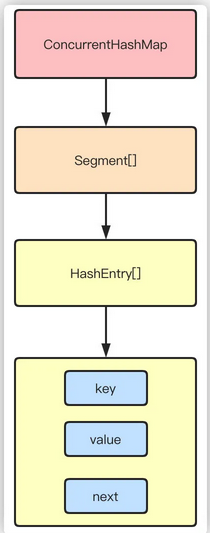

```
put流程

其实发现整个流程和HashMap非常类似，只不过是先定位到具体的Segment，然后通过ReentrantLock去操作而已，后面的流程我就简化了，因为和HashMap基本上是一样的。

    计算hash，定位到segment，segment如果是空就先初始化
    使用ReentrantLock加锁，如果获取锁失败则尝试自旋，自旋超过次数就阻塞获取，保证一定获取锁成功
    遍历HashEntry，就是和HashMap一样，数组中key和hash一样就直接替换，不存在就再插入链表，链表同样
```

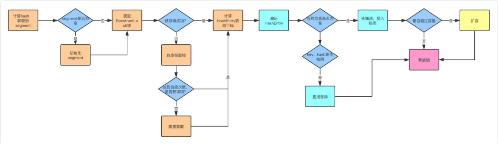

```
get流程

get也很简单，key通过hash定位到segment，再遍历链表定位到具体的元素上，需要注意的是value是volatile的，所以get是不需要加锁的。
```


**1.8CAS+synchronized**

1.8抛弃分段锁，转为用CAS+synchronized来实现，同样HashEntry改为Node，也加入了红黑树的实现。主要还是看put的流程。

# 集合-ArrayList、LinkedList

```
可以从它们的底层数据结构、效率、开销进行阐述哈

ArrayList是数组的数据结构，LinkedList是链表的数据结构。
随机访问的时候，ArrayList的效率比较高，因为LinkedList要移动指针，而ArrayList是基于索引(index)的数据结构，可以直接映射到。
插入、删除数据时，LinkedList的效率比较高，因为ArrayList要移动数据。
LinkedList比ArrayList开销更大，因为LinkedList的节点除了存储数据，还需要存储引用。
```

# 多线程-锁升级


没有竞争时，为无锁

只有一个线程尝试获得锁时，设置为偏向锁

轻度竞争时，设置轻量锁

重度竞争时，设置为重量锁

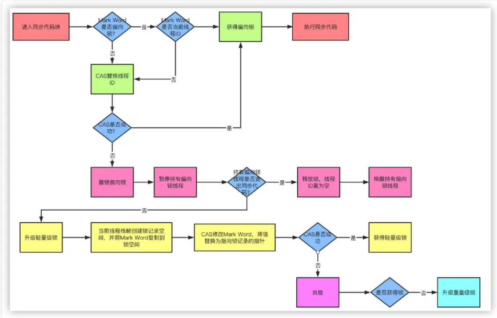


# 多线程-线程安全

并发情况下，多次访问同一代码，结果一致

保证线程安全的手段：加锁

# 多线程- volatile 和 synchronized 实现原理

**volatile 原理：**

volatile的作用就是当一个线程更新某个volatile声明的变量时，会通知其他的cpu使缓存失效，从而其他cpu想要做更新操作时，需要从内存重新读取数据

**原理**

1. 规定线程每次修改变量副本后**立刻同步到主内存**中，用于保证其它线程可以看到自己对变量的修改
2. 规定线程每次使用变量前，先从主内存中**刷新最新的值**到工作内存，用于保证能看见其它线程对变量修改的最新值
3. 为了实现可见性内存语义，编译器在生成字节码时，会在指令序列中插入**内存屏障**来**防止指令重排序**。

**注意：**

1. volatile只能保证基本类型变量的内存可见性，对于引用类型，无法保证引用所指向的**实际对象内部数据**的内存可见性。关于引用变量类型详见：[Java的数据类型](https://mp.weixin.qq.com/s/FqrnDcPt4a5SS8eTRffJdQ)。
2. volilate只能保证共享对象的**可见性**，不能保证**原子性**：假设两个线程同时在做x++，在线程A修改共享变量从0到1的同时，线程B**已经正在使用**值为0的变量，所以这时候**可见性已经无法发挥作用**，线程B将其修改为1，所以最后结果是1而不是2。

**synchronized原理：**

synchronized是java提供的原子性内置锁，这种内置的并且使用者看不到的锁也被称为**监视器锁**，使用synchronized之后，会在编译之后在同步的代码块前后加上monitorenter和monitorexit字节码指令，他依赖操作系统底层互斥锁实现。他的作用主要就是实现原子性操作和解决共享变量的内存可见性问题。

执行monitorenter指令时会尝试获取对象锁，如果对象没有被锁定或者已经获得了锁，锁的计数器+1。此时其他竞争锁的线程则会进入等待队列中。

执行monitorexit指令时则会把计数器-1，当计数器值为0时，则锁释放，处于等待队列中的线程再继续竞争锁。

synchronized是排它锁，当一个线程获得锁之后，其他线程必须等待该线程释放锁后才能获得锁，而且由于Java中的线程和操作系统原生线程是一一对应的，线程被阻塞或者唤醒时时会从用户态切换到内核态，这种转换非常消耗性能。

从内存语义来说，加锁的过程会清除工作内存中的共享变量，再从主内存读取，而释放锁的过程则是将工作内存中的共享变量写回主内存。

*实际上大部分时候我认为说到monitorenter就行了，但是为了更清楚的描述，还是再具体一点*。

如果再深入到源码来说，synchronized实际上有两个队列waitSet和entryList。

1. 当多个线程进入同步代码块时，首先进入entryList
2. 有一个线程获取到monitor锁后，就赋值给当前线程，并且计数器+1
3. 如果线程调用wait方法，将释放锁，当前线程置为null，计数器-1，同时进入waitSet等待被唤醒，调用notify或者notifyAll之后又会进入entryList竞争锁
4. 如果线程执行完毕，同样释放锁，计数器-1，当前线程置为null

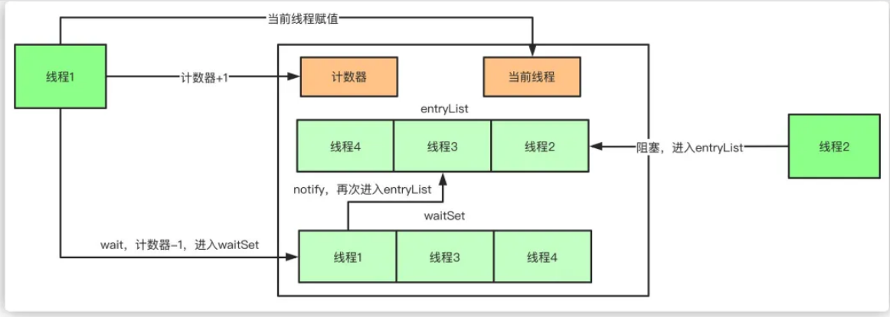


# 多线程-CAS

CAS叫做CompareAndSwap，比较并交换，主要是通过处理器的指令来保证操作的原子性，它包含三个操作数：

1. 变量内存地址，V表示
2. 旧的预期值，A表示
3. 准备设置的新值，B表示

当执行CAS指令时，只有当V等于A时，才会用B去更新V的值，否则就不会执行更新操作。

CAS的缺点主要有3点：

**ABA问题**：ABA的问题指的是在CAS更新的过程中，当读取到的值是A，然后准备赋值的时候仍然是A，但是实际上有可能A的值被改成了B，然后又被改回了A，这个CAS更新的漏洞就叫做ABA。只是ABA的问题大部分场景下都不影响并发的最终效果。

Java中有AtomicStampedReference来解决这个问题，他加入了预期标志和更新后标志两个字段，更新时不光检查值，还要检查当前的标志是否等于预期标志，全部相等的话才会更新。

**循环时间长开销大**：自旋CAS的方式如果长时间不成功，会给CPU带来很大的开销。

**只能保证一个共享变量的原子操作**：只对一个共享变量操作可以保证原子性，但是多个则不行，多个可以通过AtomicReference来处理或者使用锁synchronized实现。


# 多线程-线程的创建方式


# 多线程-停止线程的方法、唤醒线程的方法


# 多线程-JUC工具：


# IO-IO模型


# IO-常见IO流


# redis-数据类型

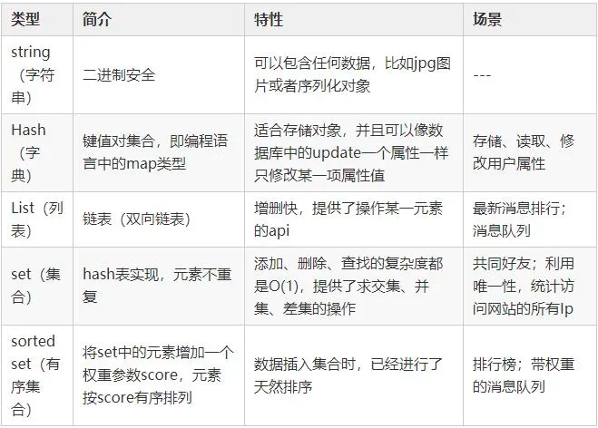


# redis-缓存雪崩、缓存穿透、缓存预热、缓存更新、缓存降级等问题


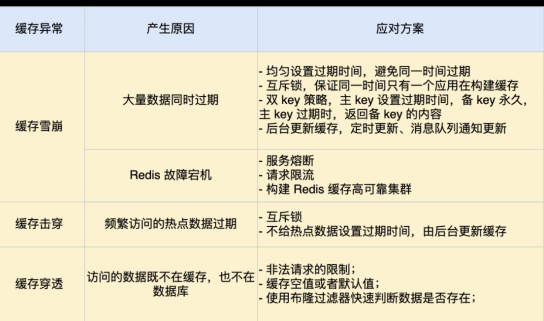

# redis-redis的过期策略以及内存淘汰机制

```
redis采用的是定期删除+惰性删除策略。

volatile-lru：从已设置过期时间的数据集（server.db[i].expires）中挑选最近最少使用的数据淘汰
volatile-ttl：从已设置过期时间的数据集（server.db[i].expires）中挑选将要过期的数据淘汰
volatile-random：从已设置过期时间的数据集（server.db[i].expires）中任意选择数据淘汰
allkeys-lru：从数据集（server.db[i].dict）中挑选最近最少使用的数据淘汰
allkeys-random：从数据集（server.db[i].dict）中任意选择数据淘汰
no-enviction（驱逐）：禁止驱逐数据，新写入操作会报错

为什么不用定时删除策略?
定时删除,用一个定时器来负责监视key,过期则自动删除。虽然内存及时释放，但是十分消耗CPU资源。
在大并发请求下，CPU要将时间应用在处理请求，而不是删除key,因此没有采用这一策略.
定期删除+惰性删除是如何工作的呢?
定期删除，redis默认每个100ms检查，是否有过期的key,有过期key则删除。需要说明的是，redis不是
每个100ms将所有的key检查一次，而是随机抽取进行检查(如果每隔100ms,全部key进行检查，redis岂
不是卡死)。因此，如果只采用定期删除策略，会导致很多key到时间没有删除。
于是，惰性删除派上用场。也就是说在你获取某个key的时候，redis会检查一下，这个key如果设置了
过期时间那么是否过期了？如果过期了此时就会删除。
采用定期删除+惰性删除就没其他问题了么?
不是的，如果定期删除没删除key。然后你也没即时去请求key，也就是说惰性删除也没生效。这样，
redis的内存会越来越高。那么就应该采用内存淘汰机制。
在redis.conf中有一行配置
该配置就是配内存淘汰策略的(什么，你没配过？好好反省一下自己)
volatile-lru：从已设置过期时间的数据集（server.db[i].expires）中挑选最近最少使用的数据淘汰
volatile-ttl：从已设置过期时间的数据集（server.db[i].expires）中挑选将要过期的数据淘汰
volatile-random：从已设置过期时间的数据集（server.db[i].expires）中任意选择数据淘汰
allkeys-lru：从数据集（server.db[i].dict）中挑选最近最少使用的数据淘汰
allkeys-random：从数据集（server.db[i].dict）中任意选择数据淘汰
no-enviction（驱逐）：禁止驱逐数据，新写入操作会报错
ps：如果没有设置 expire 的key, 不满足先决条件(prerequisites); 那么 volatile-lru, volatile-random 和
volatile-ttl 策略的行为, 和 noeviction(不删除) 基本上一致。
```


# redis的优缺点

Redis的全称是：Remote Dictionary.Server，本质上是一个Key-Value类型的内存数据库，很像 memcached，整个数据库统统加载在内存当中进行操作，定期通过异步操作把数据库数据flush到硬盘 上进行保存。

Redis的优点
性能极高 – Redis能支持超过 100K+ 每秒的读写频率。
丰富的数据类型 – Redis支持二进制案例的 Strings, Lists, Hashes, Sets 及 Ordered Sets 数据类型操作。
原子 – Redis的所有操作都是原子性的，同时Redis还支持对几个操作全并后的原子性执行。
丰富的特性 – Redis还支持 publish/subscribe, 通知, key 过期等等特性。

Redis的缺点
 是数据库容量受到物理内存的限制,不能用作海量数据的高性能读写,因此Redis适合的场景主要局限在较小数据量的高性能操作和运算上。

 总结： Redis受限于特定的场景，专注于特定的领域之下，速度相当之快，目前还未找到能替代使用产品。

# redis-持久化

RDB（默认）和AOF

Redis重启是会通过重新执行文件中保存的写命令来在内存中重建整个数据库的内容。
当两种方式同时开启时，数据恢复Redis会优先选择AOF恢复

**RDB持久化原理：**

通过bgsave命令触发，然后父进程执行fork操作创建子进程，子进程创建RDB文件，根据父进程内存生成临时快照文件，完成后对原有文件进行原子替换（定时一次性将所有数据进行快照生成一份副本存储在硬盘中）

优点：是一个紧凑压缩的二进制文件，Redis加载RDB恢复数据远远快于AOF的方式。

缺点：由于每次生成RDB开销较大，非实时持久化，

**AOF持久化原理：**

开启后，Redis每执行一个修改数据的命令，都会把这个命令添加到AOF文件中。

优点：实时持久化。

缺点：所以AOF文件体积逐渐变大，需要定期执行重写操作来降低文件体积，加载慢


# redis-同步机制

```
1.  slave启动后，向master发送SYNC命令，master接收到SYNC命令后通过bgsave保存快照（即上文所介绍的RDB持久化），并使用缓冲区记录保存快照这段时间内执行的写命令
2.  master将保存的快照文件发送给slave，并继续记录执行的写命令
3.  slave接收到快照文件后，加载快照文件，载入数据
4.  master快照发送完后开始向slave发送缓冲区的写命令，slave接收命令并执行，完成复制初始化
5.  此后master每次执行一个写命令都会同步发送给slave，保持master与slave之间数据的一致性
```


# redis-哨兵选举原理、主从变更

```
哨兵认为master客观下线后，故障恢复的操作需要由选举的领头哨兵来执行，选举采用Raft算法：

1.  发现master下线的哨兵节点（我们称他为A）向每个哨兵发送命令，要求对方选自己为领头哨兵
2.  如果目标哨兵节点没有选过其他人，则会同意选举A为领头哨兵
3.  如果有超过一半的哨兵同意选举A为领头，则A当选
4.  如果有多个哨兵节点同时参选领头，此时有可能存在一轮投票无竞选者胜出，此时每个参选的节点等待一个随机时间后再次发起参选请求，进行下一轮投票竞选，直至选举出领头哨兵

选出领头哨兵后，领头者开始对系统进行故障恢复，从出现故障的master的从数据库中挑选一个来当选新的master,选择规则如下：

1.  所有在线的slave中选择优先级最高的，优先级可以通过slave-priority配置
2.  如果有多个最高优先级的slave，则选取复制偏移量最大（即复制越完整）的当选
3.  如果以上条件都一样，选取id最小的slave

挑选出需要继任的slave后，领头哨兵向该数据库发送命令使其升格为master，然后再向其他slave发送命令接受新的master，最后更新数据。将已经停止的旧的master更新为新的master的从数据库，使其恢复服务后以slave的身份继续运行。
```


# redis-集群方案、原理、优缺点

Redis支持三种集群方案

-  主从复制模式
-  Sentinel（哨兵）模式
-  Cluster模式

#### **主从复制模式**

##### **1. 基本原理**

主从复制模式中包含一个主数据库实例（master）与一个或多个从数据库实例（slave），如下图

[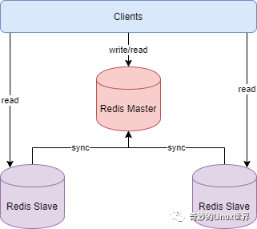](https://s4.51cto.com/oss/202011/24/f0db128a0ea1fb216b5c0afe60374c18.png)

客户端可对主数据库进行读写操作，对从数据库进行读操作，主数据库写入的数据会实时自动同步给从数据库。

##### 具体工作机制为：

1.  slave启动后，向master发送SYNC命令，master接收到SYNC命令后通过bgsave保存快照（即上文所介绍的RDB持久化），并使用缓冲区记录保存快照这段时间内执行的写命令
2.  master将保存的快照文件发送给slave，并继续记录执行的写命令
3.  slave接收到快照文件后，加载快照文件，载入数据
4.  master快照发送完后开始向slave发送缓冲区的写命令，slave接收命令并执行，完成复制初始化
5.  此后master每次执行一个写命令都会同步发送给slave，保持master与slave之间数据的一致性

**2. 部署示例**

本示例基于Redis 5.0.3版。

redis.conf的主要配置

```
###网络相关###  # bind 127.0.0.1 # 绑定监听的网卡IP，注释掉或配置成0.0.0.0可使任意IP均可访问  protected-mode no # 关闭保护模式，使用密码访问  port 6379  # 设置监听端口，建议生产环境均使用自定义端口  timeout 30 # 客户端连接空闲多久后断开连接，单位秒，0表示禁用  ###通用配置###  daemonize yes # 在后台运行  pidfile /var/run/redis_6379.pid  # pid进程文件名  logfile /usr/local/redis/logs/redis.log # 日志文件的位置  ###RDB持久化配置###  save 900 1 # 900s内至少一次写操作则执行bgsave进行RDB持久化  save 300 10  save 60 10000   # 如果禁用RDB持久化，可在这里添加 save ""  rdbcompression yes #是否对RDB文件进行压缩，建议设置为no，以（磁盘）空间换（CPU）时间  dbfilename dump.rdb # RDB文件名称  dir /usr/local/redis/datas # RDB文件保存路径，AOF文件也保存在这里  ###AOF配置###  appendonly yes # 默认值是no，表示不使用AOF增量持久化的方式，使用RDB全量持久化的方式  appendfsync everysec # 可选值 always， everysec，no，建议设置为everysec  ###设置密码###  requirepass 123456 # 设置复杂一点的密码 
```

部署主从复制模式只需稍微调整slave的配置，在redis.conf中添加

```
replicaof 127.0.0.1 6379 # master的ip，port  masterauth 123456 # master的密码 replica-serve-stale-data no # 如果slave无法与master同步，设置成slave不可读，方便监控脚本发现问题 
```

本示例在单台服务器上配置master端口6379，两个slave端口分别为7001,7002，启动master，再启动两个slave

```
[root@dev-server-1 master-slave]# redis-server master.conf  [root@dev-server-1 master-slave]# redis-server slave1.conf  [root@dev-server-1 master-slave]# redis-server slave2.conf 
```

进入master数据库，写入一个数据，再进入一个slave数据库，立即便可访问刚才写入master数据库的数据。如下所示

```
[root@dev-server-1 master-slave]# redis-cli   127.0.0.1:6379> auth 123456  OK  127.0.0.1:6379> set site blog.jboost.cn  OK  127.0.0.1:6379> get site  "blog.jboost.cn"  127.0.0.1:6379> info replication  # Replication  role:master  connected_slaves:2  slave0:ip=127.0.0.1,port=7001,state=online,offset=13364738,lag=1  slave1:ip=127.0.0.1,port=7002,state=online,offset=13364738,lag=0 ...  127.0.0.1:6379> exit  [root@dev-server-1 master-slave]# redis-cli -p 7001  127.0.0.1:7001> auth 123456  OK  127.0.0.1:7001> get site  "blog.jboost.cn" 
```

执行info replication命令可以查看连接该数据库的其它库的信息，如上可看到有两个slave连接到master

##### **3. 主从复制的优缺点**

优点：

1.  master能自动将数据同步到slave，可以进行读写分离，分担master的读压力
2.  master、slave之间的同步是以非阻塞的方式进行的，同步期间，客户端仍然可以提交查询或更新请求

缺点：

1.  不具备自动容错与恢复功能，master或slave的宕机都可能导致客户端请求失败，需要等待机器重启或手动切换客户端IP才能恢复
2.  master宕机，如果宕机前数据没有同步完，则切换IP后会存在数据不一致的问题
3.  难以支持在线扩容，Redis的容量受限于单机配置

#### Sentinel（哨兵）模式

##### **1. 基本原理**

哨兵模式基于主从复制模式，只是引入了哨兵来监控与自动处理故障。如图

[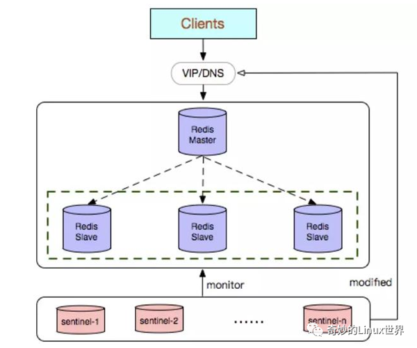](https://s3.51cto.com/oss/202011/24/a06050d21ae41e935fc23d5c46453fec.png)

哨兵顾名思义，就是来为Redis集群站哨的，一旦发现问题能做出相应的应对处理。其功能包括

1.  监控master、slave是否正常运行
2.  当master出现故障时，能自动将一个slave转换为master（大哥挂了，选一个小弟上位）
3.  多个哨兵可以监控同一个Redis，哨兵之间也会自动监控

##### 哨兵模式的具体工作机制：

在配置文件中通过 sentinel monitor来定位master的IP、端口，一个哨兵可以监控多个master数据库，只需要提供多个该配置项即可。哨兵启动后，会与要监控的master建立两条连接：

1.  一条连接用来订阅master的_sentinel_:hello频道与获取其他监控该master的哨兵节点信息
2.  另一条连接定期向master发送INFO等命令获取master本身的信息

与master建立连接后，哨兵会执行三个操作：

1.  定期（一般10s一次，当master被标记为主观下线时，改为1s一次）向master和slave发送INFO命令
2.  定期向master和slave的_sentinel_:hello频道发送自己的信息
3.  定期（1s一次）向master、slave和其他哨兵发送PING命令

发送INFO命令可以获取当前数据库的相关信息从而实现新节点的自动发现。所以说哨兵只需要配置master数据库信息就可以自动发现其slave信息。获取到slave信息后，哨兵也会与slave建立两条连接执行监控。通过INFO命令，哨兵可以获取主从数据库的最新信息，并进行相应的操作，比如角色变更等。

接下来哨兵向主从数据库的sentinel:hello频道发送信息与同样监控这些数据库的哨兵共享自己的信息，发送内容为哨兵的ip端口、运行id、配置版本、master名字、master的ip端口还有master的配置版本。这些信息有以下用处：

1.  其他哨兵可以通过该信息判断发送者是否是新发现的哨兵，如果是的话会创建一个到该哨兵的连接用于发送PING命令。
2.  其他哨兵通过该信息可以判断master的版本，如果该版本高于直接记录的版本，将会更新
3.  当实现了自动发现slave和其他哨兵节点后，哨兵就可以通过定期发送PING命令定时监控这些数据库和节点有没有停止服务。

如果被PING的数据库或者节点超时（通过 sentinel down-after-milliseconds master-name  milliseconds 配置）未回复，哨兵认为其主观下线（sdown，s就是Subjectively ——  主观地）。如果下线的是master，哨兵会向其它哨兵发送命令询问它们是否也认为该master主观下线，如果达到一定数目（即配置文件中的quorum）投票，哨兵会认为该master已经客观下线（odown，o就是Objectively ——  客观地），并选举领头的哨兵节点对主从系统发起故障恢复。若没有足够的sentinel进程同意master下线，master的客观下线状态会被移除，若master重新向sentinel进程发送的PING命令返回有效回复，master的主观下线状态就会被移除

哨兵认为master客观下线后，故障恢复的操作需要由选举的领头哨兵来执行，选举采用Raft算法：

1.  发现master下线的哨兵节点（我们称他为A）向每个哨兵发送命令，要求对方选自己为领头哨兵
2.  如果目标哨兵节点没有选过其他人，则会同意选举A为领头哨兵
3.  如果有超过一半的哨兵同意选举A为领头，则A当选
4.  如果有多个哨兵节点同时参选领头，此时有可能存在一轮投票无竞选者胜出，此时每个参选的节点等待一个随机时间后再次发起参选请求，进行下一轮投票竞选，直至选举出领头哨兵

选出领头哨兵后，领头者开始对系统进行故障恢复，从出现故障的master的从数据库中挑选一个来当选新的master,选择规则如下：

1.  所有在线的slave中选择优先级最高的，优先级可以通过slave-priority配置
2.  如果有多个最高优先级的slave，则选取复制偏移量最大（即复制越完整）的当选
3.  如果以上条件都一样，选取id最小的slave

挑选出需要继任的slave后，领头哨兵向该数据库发送命令使其升格为master，然后再向其他slave发送命令接受新的master，最后更新数据。将已经停止的旧的master更新为新的master的从数据库，使其恢复服务后以slave的身份继续运行。

**2. 部署演示**

本示例基于Redis 5.0.3版。

哨兵模式基于前文的主从复制模式。哨兵的配置文件为sentinel.conf，在文件中添加

```
sentinel monitor mymaster 127.0.0.1 6379 1 # mymaster定义一个master数据库的名称，后面是master的ip， port，1表示至少需要一个Sentinel进程同意才能将master判断为失效，如果不满足这个条件，则自动故障转移（failover）不会执行 sentinel auth-pass mymaster 123456 # master的密码 sentinel down-after-milliseconds mymaster 5000 # 5s未回复PING，则认为master主观下线，默认为30s sentinel parallel-syncs mymaster 2  # 指定在执行故障转移时，最多可以有多少个slave实例在同步新的master实例，在slave实例较多的情况下这个数字越小，同步的时间越长，完成故障转移所需的时间就越长 sentinel failover-timeout mymaster 300000 # 如果在该时间（ms）内未能完成故障转移操作，则认为故障转移失败，生产环境需要根据数据量设置该值 
```

一个哨兵可以监控多个master数据库，只需按上述配置添加多套

分别以26379,36379,46379端口启动三个sentinel

```
[root@dev-server-1 sentinel]# redis-server sentinel1.conf --sentinel  [root@dev-server-1 sentinel]# redis-server sentinel2.conf --sentinel [root@dev-server-1 sentinel]# redis-server sentinel3.conf --sentinel 
```

也可以使用redis-sentinel sentinel1.conf 命令启动。此时集群包含一个master、两个slave、三个sentinel，如图，

[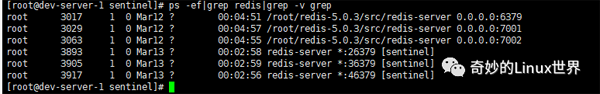](https://s6.51cto.com/oss/202011/24/dc00c880ec3d5e9997de406d0767b8e4.png)

我们来模拟master挂掉的场景，执行 kill -9 3017 将master进程干掉，进入slave中执行 info replication查看，

```
[root@dev-server-1 sentinel]# redis-cli -p 7001  127.0.0.1:7001> auth 123456  OK  127.0.0.1:7001> info replication  # Replication  role:slave  master_host:127.0.0.1  master_port:7002  master_link_status:up  master_last_io_seconds_ago:1  master_sync_in_progress:0  # 省略  127.0.0.1:7001> exit  [root@dev-server-1 sentinel]# redis-cli -p 7002  127.0.0.1:7002> auth 123456  OK  127.0.0.1:7002> info replication  # Replication  role:master  connected_slaves:1  slave0:ip=127.0.0.1,port=7001,state=online,offset=13642721,lag=1  # 省略 
```

可以看到slave 7002已经成功上位晋升为master（role：master），接收一个slave  7001的连接。此时查看slave2.conf配置文件，发现replicaof的配置已经被移除了，slave1.conf的配置文件里replicaof 127.0.0.1 6379 被改为 replicaof 127.0.0.1  7002。重新启动master，也可以看到master.conf配置文件中添加了replicaof 127.0.0.1  7002的配置项，可见大哥（master）下位后，再出来混就只能当当小弟（slave）了，三十年河东三十年河西。

##### **3. 哨兵模式的优缺点**

优点：

1.  哨兵模式基于主从复制模式，所以主从复制模式有的优点，哨兵模式也有
2.  哨兵模式下，master挂掉可以自动进行切换，系统可用性更高

缺点：

1.  同样也继承了主从模式难以在线扩容的缺点，Redis的容量受限于单机配置
2.  需要额外的资源来启动sentinel进程，实现相对复杂一点，同时slave节点作为备份节点不提供服务

#### **Cluster模式**

##### **1. 基本原理**

哨兵模式解决了主从复制不能自动故障转移，达不到高可用的问题，但还是存在难以在线扩容，Redis容量受限于单机配置的问题。Cluster模式实现了Redis的分布式存储，即每台节点存储不同的内容，来解决在线扩容的问题。如图

[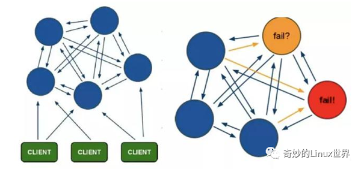](https://s4.51cto.com/oss/202011/24/5a3caf9e0f95b0520634ad133eed920c.png)

Cluster采用无中心结构,它的特点如下：

1.  所有的redis节点彼此互联(PING-PONG机制),内部使用二进制协议优化传输速度和带宽
2.  节点的fail是通过集群中超过半数的节点检测失效时才生效
3.  客户端与redis节点直连,不需要中间代理层.客户端不需要连接集群所有节点,连接集群中任何一个可用节点即可

##### Cluster模式的具体工作机制：

  \1. 在Redis的每个节点上，都有一个插槽（slot），取值范围为0-16383

  \2.  当我们存取key的时候，Redis会根据CRC16的算法得出一个结果，然后把结果对16384求余数，这样每个key都会对应一个编号在0-16383之间的哈希槽，通过这个值，去找到对应的插槽所对应的节点，然后直接自动跳转到这个对应的节点上进行存取操作

  \3. 为了保证高可用，Cluster模式也引入主从复制模式，一个主节点对应一个或者多个从节点，当主节点宕机的时候，就会启用从节点

  \4. 当其它主节点ping一个主节点A时，如果半数以上的主节点与A通信超时，那么认为主节点A宕机了。如果主节点A和它的从节点都宕机了，那么该集群就无法再提供服务了

Cluster模式集群节点最小配置6个节点(3主3从，因为需要半数以上)，其中主节点提供读写操作，从节点作为备用节点，不提供请求，只作为故障转移使用。

**2. 部署演示**

本示例基于Redis 5.0.3版。

Cluster模式的部署比较简单，首先在redis.conf中

```
port 7100 # 本示例6个节点端口分别为7100,7200,7300,7400,7500,7600   daemonize yes # r后台运行   pidfile /var/run/redis_7100.pid # pidfile文件对应7100,7200,7300,7400,7500,7600   cluster-enabled yes # 开启集群模式   masterauth passw0rd # 如果设置了密码，需要指定master密码  cluster-config-file nodes_7100.conf # 集群的配置文件，同样对应7100,7200等六个节点  cluster-node-timeout 15000 # 请求超时 默认15秒，可自行设置 
```

分别以端口7100,7200,7300,7400,7500,7600 启动六个实例(如果是每个服务器一个实例则配置可一样)

```
[root@dev-server-1 cluster]# redis-server redis_7100.conf  [root@dev-server-1 cluster]# redis-server redis_7200.conf  ... 
```

然后通过命令将这个6个实例组成一个3主节点3从节点的集群，

```
redis-cli --cluster create --cluster-replicas 1 127.0.0.1:7100 127.0.0.1:7200 127.0.0.1:7300 127.0.0.1:7400 127.0.0.1:7500 127.0.0.1:7600 -a passw0rd 
```

执行结果如图

[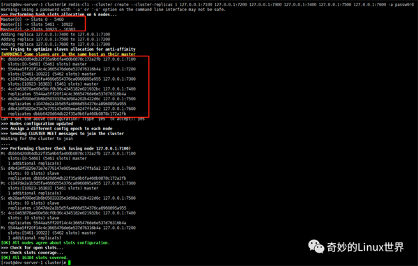](https://s2.51cto.com/oss/202011/24/95ebf3f9d44e442bbaba88eab76179e2.png)

可以看到 7100， 7200， 7300 作为3个主节点，分配的slot分别为 0-5460， 5461-10922， 10923-16383， 7600作为7100的slave， 7500作为7300的slave，7400作为7200的slave。

我们连接7100设置一个值

```
[root@dev-server-1 cluster]# redis-cli -p 7100 -c -a passw0rd  Warning: Using a password with '-a' or '-u' option on the command line interface may not be safe.  127.0.0.1:7100> set site blog.jboost.cn  -> Redirected to slot [9421] located at 127.0.0.1:7200  OK  127.0.0.1:7200> get site  "blog.jboost.cn"  127.0.0.1:7200> 
```

注意添加 -c 参数表示以集群模式，否则报 (error) MOVED 9421 127.0.0.1:7200 错误， 以 -a 参数指定密码，否则报(error) NOAUTH Authentication required错误。

从上面命令看到key为site算出的slot为9421，落在7200节点上，所以有Redirected to slot [9421] located at 127.0.0.1:7200，集群会自动进行跳转。因此客户端可以连接任何一个节点来进行数据的存取。

通过cluster nodes可查看集群的节点信息

```
127.0.0.1:7200> cluster nodes  eb28aaf090ed1b6b05033335e3d90a202b422d6c 127.0.0.1:7500@17500 slave c1047de2a1b5d5fa4666d554376ca8960895a955 0 1584165266071 5 connected  4cc0463878ae00e5dcf0b36c4345182e021932bc 127.0.0.1:7400@17400 slave 5544aa5ff20f14c4c3665476de6e537d76316b4a 0 1584165267074 4 connected  dbbb6420d64db22f35a9b6fa460b0878c172a2fb 127.0.0.1:7100@17100 master - 0 1584165266000 1 connected 0-5460  d4b434f5829e73e7e779147e905eea6247ffa5a2 127.0.0.1:7600@17600 slave dbbb6420d64db22f35a9b6fa460b0878c172a2fb 0 1584165265000 6 connected  5544aa5ff20f14c4c3665476de6e537d76316b4a 127.0.0.1:7200@17200 myself,master - 0 1584165267000 2 connected 5461-10922  c1047de2a1b5d5fa4666d554376ca8960895a955 127.0.0.1:7300@17300 master - 0 1584165268076 3 connected 10923-16383 
```

我们将7200通过 kill -9 pid杀死进程来验证集群的高可用，重新进入集群执行cluster nodes可以看到7200 fail了，但是7400成了master，重新启动7200，可以看到此时7200已经变成了slave。

##### **3. Cluster模式的优缺点**

优点：

  \1. 无中心架构，数据按照slot分布在多个节点。

  \2. 集群中的每个节点都是平等的关系，每个节点都保存各自的数据和整个集群的状态。每个节点都和其他所有节点连接，而且这些连接保持活跃，这样就保证了我们只需要连接集群中的任意一个节点，就可以获取到其他节点的数据。

  \3. 可线性扩展到1000多个节点，节点可动态添加或删除

  \4. 能够实现自动故障转移，节点之间通过gossip协议交换状态信息，用投票机制完成slave到master的角色转换

缺点：

1.  客户端实现复杂，驱动要求实现Smart Client，缓存slots mapping信息并及时更新，提高了开发难度。目前仅JedisCluster相对成熟，异常处理还不完善，比如常见的“max redirect exception”
2.  节点会因为某些原因发生阻塞（阻塞时间大于 cluster-node-timeout）被判断下线，这种failover是没有必要的
3.  数据通过异步复制，不保证数据的强一致性
4.  slave充当“冷备”，不能缓解读压力
5.  批量操作限制，目前只支持具有相同slot值的key执行批量操作，对mset、mget、sunion等操作支持不友好
6.  key事务操作支持有线，只支持多key在同一节点的事务操作，多key分布不同节点时无法使用事务功能
7.  不支持多数据库空间，单机redis可以支持16个db，集群模式下只能使用一个，即db 0

Redis Cluster模式不建议使用pipeline和multi-keys操作，减少max redirect产生的场景


# RabbitMQ-保证消息不丢失

**哪些场景导致消息丢失**


**怎么防消息丢失**


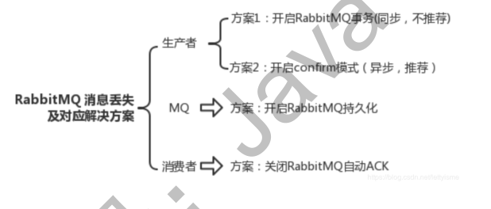


# RabbitMQ-保证消费幂等性、不可重复消费

# RabbitMQ-保证消息顺序

# 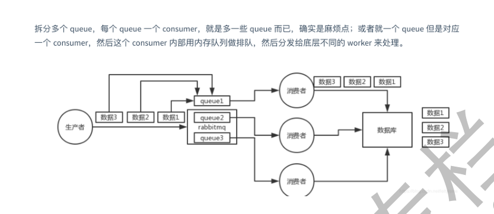保证分布式事务一致性


# RabbitMQ-设计一个MQ


# Spring-IOC


```
（1）IOC就是控制反转，是指创建对象的控制权的转移，以前创建对象的主动权和时机是由自己把控
的，而现在这种权力转移到Spring容器中，并由容器根据配置文件去创建实例和管理各个实例之间的依
赖关系，对象与对象之间松散耦合，也利于功能的复用。DI依赖注入，和控制反转是同一个概念的不同
角度的描述，即 应用程序在运行时依赖IoC容器来动态注入对象需要的外部资源。
（2）最直观的表达就是，IOC让对象的创建不用去new了，可以由spring自动生产，使用java的反射机
制，根据配置文件在运行时动态的去创建对象以及管理对象，并调用对象的方法的。
（3）Spring的IOC有三种注入方式 ：构造器注入、setter方法注入、根据注解注入。
IoC让相互协作的组件保持松散的耦合，而AOP编程允许你把遍布于应用各层的功能分离出来形成
可重用的功能组件
```


# Spring-AOP

```
OOP面向对象，允许开发者定义纵向的关系，但并适用于定义横向的关系，导致了大量代码的重复，而
不利于各个模块的重用。
AOP，一般称为面向切面，作为面向对象的一种补充，用于将那些与业务无关，但却对多个对象产生影
响的公共行为和逻辑，抽取并封装为一个可重用的模块，这个模块被命名为“切面”（Aspect），减少系
统中的重复代码，降低了模块间的耦合度，同时提高了系统的可维护性。可用于权限认证、日志、事务
处理。
AOP实现的关键在于 代理模式，AOP代理主要分为静态代理和动态代理。静态代理的代表为AspectJ；
动态代理则以Spring AOP为代表。
（1）AspectJ是静态代理的增强，所谓静态代理，就是AOP框架会在编译阶段生成AOP代理类，因此也
称为编译时增强，他会在编译阶段将AspectJ(切面)织入到Java字节码中，运行的时候就是增强之后的
AOP对象。
（2）Spring AOP使用的动态代理，所谓的动态代理就是说AOP框架不会去修改字节码，而是每次运行
时在内存中临时为方法生成一个AOP对象，这个AOP对象包含了目标对象的全部方法，并且在特定的切
点做了增强处理，并回调原对象的方法。
Spring AOP中的动态代理主要有两种方式，JDK动态代理和CGLIB动态代理：
 ①JDK动态代理只提供接口的代理，不支持类的代理。核心InvocationHandler接口和Proxy类，
InvocationHandler 通过invoke()方法反射来调用目标类中的代码，动态地将横切逻辑和业务编织在一
起；接着，Proxy利用 InvocationHandler动态创建一个符合某一接口的的实例, 生成目标类的代理对
象。
 ②如果代理类没有实现 InvocationHandler 接口，那么Spring AOP会选择使用CGLIB来动态代理目
标类。CGLIB（Code Generation Library），是一个代码生成的类库，可以在运行时动态的生成指定类
的一个子类对象，并覆盖其中特定方法并添加增强代码，从而实现AOP。CGLIB是通过继承的方式做的动态代
理，因此如果某个类被标记为final，那么它是无法使用CGLIB做动态代理的。
（3）静态代理与动态代理区别在于生成AOP代理对象的时机不同，相对来说AspectJ的静态代理方式具
有更好的性能，但是AspectJ需要特定的编译器进行处理，而Spring AOP则无需特定的编译器处理。
```


# Spring-JPA


# Spring-创建一个bean对象的过程/bean 的生命周期

实例化-》属性赋值-》初始化-》销毁

```
（1）实例化Bean：
对于BeanFactory容器，当客户向容器请求一个尚未初始化的bean时，或初始化bean的时候需要注入
另一个尚未初始化的依赖时，容器就会调用createBean进行实例化。对于ApplicationContext容器，当
容器启动结束后，通过获取BeanDefinition对象中的信息，实例化所有的bean。
（2）设置对象属性（依赖注入）：
实例化后的对象被封装在BeanWrapper对象中，紧接着，Spring根据BeanDefinition中的信息 以及 通
过BeanWrapper提供的设置属性的接口完成依赖注入。
（3）处理Aware接口：
接着，Spring会检测该对象是否实现了xxxAware接口，并将相关的xxxAware实例注入给Bean：
①如果这个Bean已经实现了BeanNameAware接口，会调用它实现的setBeanName(String beanId)方
法，此处传递的就是Spring配置文件中Bean的id值；
②如果这个Bean已经实现了BeanFactoryAware接口，会调用它实现的setBeanFactory()方法，传递的
是Spring工厂自身。
③如果这个Bean已经实现了ApplicationContextAware接口，会调用
setApplicationContext(ApplicationContext)方法，传入Spring上下文；
（4）BeanPostProcessor：
如果想对Bean进行一些自定义的处理，那么可以让Bean实现了BeanPostProcessor接口，那将会调用
postProcessBeforeInitialization(Object obj, String s)方法。
（5）InitializingBean 与 init-method：
如果Bean在Spring配置文件中配置了 init-method 属性，则会自动调用其配置的初始化方法。
（6）如果这个Bean实现了BeanPostProcessor接口，将会调用postProcessAfterInitialization(Object
obj, String s)方法；由于这个方法是在Bean初始化结束时调用的，所以可以被应用于内存或缓存技术；
>>>>以上几个步骤完成后，Bean就已经被正确创建了，之后就可以使用这个Bean了。
（7）DisposableBean：
当Bean不再需要时，会经过清理阶段，如果Bean实现了DisposableBean这个接口，会调用其实现的
destroy()方法；
（8）destroy-method：
最后，如果这个Bean的Spring配置中配置了destroy-method属性，会自动调用其配置的销毁方法。
```


# Spring-事务、事务传播机制


支持编程式事务管理、声明式事务管理


事务传播机制


**传播行为**

事务的第一个方面是传播行为（propagation behavior）。当事务方法被另一个事务方法调用时，必须指定事务应该如何传播。例如：方法可能继续在现有事务中运行，也可能开启一个新事务，并在自己的事务中运行。Spring定义了七种传播行为：

| 传播行为                  | 含义                                                         |
| ------------------------- | ------------------------------------------------------------ |
| PROPAGATION_REQUIRED      | 表示当前方法必须运行在事务中。如果当前事务存在，方法将会在该事务中运行。否则，会启动一个新的事务 |
| PROPAGATION_SUPPORTS      | 表示当前方法不需要事务上下文，但是如果存在当前事务的话，那么该方法会在这个事务中运行 |
| PROPAGATION_MANDATORY     | 表示该方法必须在事务中运行，如果当前事务不存在，则会抛出一个异常 |
| PROPAGATION_REQUIRED_NEW  | 表示当前方法必须运行在它自己的事务中。一个新的事务将被启动。如果存在当前事务，在该方法执行期间，当前事务会被挂起。如果使用JTATransactionManager的话，则需要访问TransactionManager |
| PROPAGATION_NOT_SUPPORTED | 表示该方法不应该运行在事务中。如果存在当前事务，在该方法运行期间，当前事务将被挂起。如果使用JTATransactionManager的话，则需要访问TransactionManager |
| PROPAGATION_NEVER         | 表示当前方法不应该运行在事务上下文中。如果当前正有一个事务在运行，则会抛出异常 |
| PROPAGATION_NESTED        | 表示如果当前已经存在一个事务，那么该方法将会在嵌套事务中运行。嵌套的事务可以独立于当前事务进行单独地提交或回滚。如果当前事务不存在，那么其行为与PROPAGATION_REQUIRED一样。注意各厂商对这种传播行为的支持是有所差异的。可以参考资源管理器的文档来确认它们是否支持嵌套事务 |

``` 
PROPAGATION_REQUIRED / REQUIRED (默认)

REQUIRES_NEW

NESTED

SUPPORTS

NOT_SUPPORTED

MANDATORY

NEVER
```


``` 

PROPAGATION_REQUIRED / REQUIRED (默认)

支持当前事务，如果当前没有事务，则新建事务

如果当前存在事务，则加入当前事务，合并成一个事务

如果上下文中已经存在事务，那么就加入到事务中执行，如果当前上下文中不存在事务，则新建事务执行。所以这个级别通常能满足处理大多数的业务场景。

子事务回滚，父事务一定回滚

父事务回滚，子事务一定回滚


REQUIRES_NEW

新建事务，如果当前存在事务，则把当前事务挂起

这个方法会独立提交事务，不受调用者的事务影响，父级异常，它也是正常提交

NESTED

如果当前存在事务，它将会成为父级事务的一个子事务，方法结束后并没有提交，只有等父事务结束才提交
如果当前没有事务，则新建事务
如果它异常，父级可以捕获它的异常而不进行回滚，正常提交
但如果父级异常，它必然回滚，这就是和 REQUIRES_NEW 的区别

SUPPORTS

如果当前存在事务，则加入事务
如果当前不存在事务，则以非事务方式运行，这个和不写没区别

NOT_SUPPORTED

以非事务方式运行
如果当前存在事务，则把当前事务挂起

MANDATORY

如果当前存在事务，则运行在当前事务中
如果当前无事务，则抛出异常，也即父级方法必须有事务

NEVER

以非事务方式运行，如果当前存在事务，则抛出异常，即父级方法必须无事务

```


# SpringMVC-工作流程

```
1、 用户发送请求至前端控制器DispatcherServlet。
2、 DispatcherServlet收到请求调用HandlerMapping处理器映射器。
3、 处理器映射器找到具体的处理器(可以根据xml配置、注解进行查找)，生成处理器对象及处理器拦截
器(如果有则生成)一并返回给DispatcherServlet。
4、 DispatcherServlet调用HandlerAdapter处理器适配器。
5、 HandlerAdapter经过适配调用具体的处理器(Controller，也叫后端控制器)。
6、 Controller执行完成返回ModelAndView。
7、 HandlerAdapter将controller执行结果ModelAndView返回给DispatcherServlet。
8、 DispatcherServlet将ModelAndView传给ViewReslover视图解析器。
9、 ViewReslover解析后返回具体View。
10、DispatcherServlet根据View进行渲染视图（即将模型数据填充至视图中）。
11、 DispatcherServlet响应用户。
```


# Mybatis-简介、优缺点


# Mybatis-工作过程

```
1、创建 SqlSessionFactory
2、通过 SqlSessionFactory 创建 SqlSession
3、通过 sqlsession 执行数据库操作
4、调用 session.commit()提交事务
5、调用 session.close()关闭会话
```


# Mybatis-绑定sql原理

```
接口绑定，就是在 MyBatis 中任意定义接口,然后把接口里面的方法和 SQL 语句绑定, 我们直接调用接口方法就可以,这样比起原来了 SqlSession 提供的方法我们可以有更加灵活的选择和设置。

接口绑定有两种实现方式,一种是通过注解绑定，就是在接口的方法上面加上@Select、@Update 等注解，里面包含 Sql 语句来绑定；另外一种就是通过 xml里面写 SQL 来绑定, 在这种情况下,要指定 xml 映射文件里面的 namespace 必须为接口的全路径名。当 Sql 语句比较简单时候,用注解绑定, 当 SQL 语句比较复杂时候,用 xml 绑定,一般用 xml 绑定的比较多。
```


# Mybatis-常用标签

```
select

insert

updae

delete

trim  where  set  foreach  if  choose  when  otherwise   bind  sql
```


# Mybatis-缓存

```
1）一级缓存: 基于 PerpetualCache 的 HashMap 本地缓存，其存储作用域为 Session，当 Session flush 或 close 之后，该 Session 中的所有 Cache 就 将清空，默认打开一级缓存。

2）二级缓存与一级缓存其机制相同，默认也是采用 PerpetualCache，HashMap存储，不同在于其存储作用域为 Mapper(Namespace)，并且可自定义存储源，如 Ehcache。默认不打开二级缓存，要开启二级缓存，使用二级缓存属性类需要实现 Serializable 序列化接口(可用来保存对象的状态),可在它的映射文件中配置；

3）对于缓存数据更新机制，当某一个作用域(一级缓存 Session/二级缓存Namespaces)的进行了 C/U/D 操作后，默认该作用域下所有 select 中的缓存将被 clear。
```


## MyBatis 实现一对一有几种方式?具体怎么操作的？

有联合查询和嵌套查询,联合查询是几个表联合查询,只查询一次, 通过在
resultMap 里面配置 association 节点配置一对一的类就可以完成；
嵌套查询是先查一个表，根据这个表里面的结果的 外键 id，去再另外一个表里面
查询数据,也是通过 association 配置，但另外一个表的查询通过 select 属性配置。

## MyBatis 实现一对多有几种方式,怎么操作的？

有联合查询和嵌套查询。联合查询是几个表联合查询,只查询一次,通过在
resultMap 里面的 collection 节点配置一对多的类就可以完成；嵌套查询是先查
一个表,根据这个表里面的 结果的外键 id,去再另外一个表里面查询数据,也是通过
配置 collection,但另外一个表的查询通过 select 节点配置。

# MySQL-为什么使用B+tree索引、不使用B tree 索引

```
索引为什么采用 B+树
B+树更有利于对数据库的扫描
B 树在提高了磁盘 IO 性能的同时并没有解决元素遍历的效率低下的问题，而 B+ 树只需要遍历叶子
节点就可以解决对全部关键字信息的扫描，所以对于数据库中频繁使 用的 range query，B+树有
着更高的性能。
B+树的磁盘读写代价更低
B+树的内部结点并没有指向关键字具体信息的指针。因此其内部结点相对 B 树更小。如果把所有同
一内部结点的关键字存放在同一盘块中，那么盘块所能容纳的关键字 数量也越多。一次性读入内存
中的需要查找的关键字也就越多。相对来说 I/O 读写次数也就降低了。
B+树的查询效率更加稳定
由于内部结点并不是最终指向文件内容的结点，而只是叶子结点中关键字的索引。 所以任何关键字
的查找必须走一条从根结点到叶子结点的路。所有关键字查询的路径长度相同，导致每一个数据的
查询效率相当。
```


# MySQL-慢查询优化


# MySQL-分库分表、大表如何优化


# MySQL-存储引擎


# MySQL-不停止业务的情况下，进行数据迁移


# MySQL-聚集索引、非聚集索引、聚簇索引、稀疏索引、稠密索引

聚集索引：指索引项的排序方式和表中数据记录排序方式一致的索引 

```

也就是说聚集索引的顺序就是数据的物理存储顺序。它会根据聚集索引键的顺序来存储表中的数据，即对表的数据按索引键的顺序进行排序，然后重新存储到磁盘上。因为数据在物理存放时只能有一种排列方式，所以一个表只能有一个聚集索引。

聚集索引的使用场合为： 

　　a.查询命令的回传结果是以该字段为排序依据的； 

　　b.查询的结果返回一个区间的值； 

　　c.查询的结果返回某值相同的大量结果集。 

聚集索引会降低 insert，和update操作的性能，所以，是否使用聚集索引要全面衡量。

```


非聚集索引： 索引顺序与物理存储顺序不同

```
非聚集索引的使用场合为： 

　　a.查询所获数据量较少时； 

　　b.某字段中的数据的唯一性比较高时；

非聚集索引必须是稠密索引
```

聚簇索引

聚簇索引并不是一种单独的索引类型，而是一种数据存储方式。术语“聚族”表示数据行和相邻的键值紧凑的存储在一起。因为无法同时把数据行放在两个不同的地方，所以一个表只能有一个聚族索引。 

```
聚族索引的优点 

可以把相关数据保存在一起。就好像在操场上战队，一个院系一个院系的站在一起，这样要找到一个人，就先找到他的院系，然后在他的院系里找到他就行了，而不是把学校里的所有人都遍历一遍

数据访问更快。聚族索引将索引和数据保存在同一个B-Tree中，因此从聚族索引中获取数据通常比在非聚族索引中查找更快
```

稠密索引

稠密索引：每个索引键值都对应有一个索引项

```
稠密索引能够比稀疏索引更快的定位一条记录。但是，稀疏索引相比于稠密索引的优点是：它所占空间更小，且插入和删除时的维护开销也小。
```


稀疏索引

稀疏索引：相对于稠密索引，稀疏索引只为某些搜索码值建立索引记录；在搜索时，找到其最大的搜索码值小于或等于所查找记录的搜索码值的索引项，然后从该记录开始向后顺序查询直到找到为止。 

```

```


# 设计模式-简单理解


# 设计模式-工厂模式 VS 建造者模式


# 网络-三次握手


 所谓三次握手（Three-Way Handshake）即建立TCP连接，就是指建立一个TCP连接时，需要客户端和服务端总共发送3个包以确认连接的建立。在socket编程中，这一过程由客户端执行connect来触发，整个流程如下图所示：

  
图2 TCP三次握手

​    （1）第一次握手：Client将标志位SYN置为1，随机产生一个值seq=J，并将该数据包发送给Server，Client进入SYN_SENT状态，等待Server确认。
​      （2）第二次握手：Server收到数据包后由标志位SYN=1知道Client请求建立连接，Server将标志位SYN和ACK都置为1，ack=J+1，随机产生一个值seq=K，并将该数据包发送给Client以确认连接请求，Server进入SYN_RCVD状态。
​      （3）第三次握手：Client收到确认后，检查ack是否为J+1，ACK是否为1，如果正确则将标志位ACK置为1，ack=K+1，并将该数据包发送给Server，Server检查ack是否为K+1，ACK是否为1，如果正确则连接建立成功，Client和Server进入ESTABLISHED状态，完成三次握手，随后Client与Server之间可以开始传输数据了。


# 网络-四次挥手


  三次握手耳熟能详，四次挥手估计就，所谓四次挥手（Four-Way Wavehand）即终止TCP连接，就是指断开一个TCP连接时，需要客户端和服务端总共发送4个包以确认连接的断开。在socket编程中，这一过程由客户端或服务端任一方执行close来触发，整个流程如下图所示：

  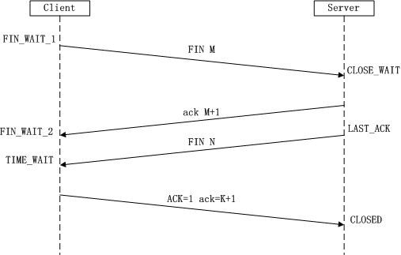
图3 TCP四次挥手

​      由于TCP连接时全双工的，因此，每个方向都必须要单独进行关闭，这一原则是当一方完成数据发送任务后，发送一个FIN来终止这一方向的连接，收到一个FIN只是意味着这一方向上没有数据流动了，即不会再收到数据了，但是在这个TCP连接上仍然能够发送数据，直到这一方向也发送了FIN。首先进行关闭的一方将执行主动关闭，而另一方则执行被动关闭，上图描述的即是如此。
​    （1）第一次挥手：Client发送一个FIN，用来关闭Client到Server的数据传送，Client进入FIN_WAIT_1状态。
​    （2）第二次挥手：Server收到FIN后，发送一个ACK给Client，确认序号为收到序号+1（与SYN相同，一个FIN占用一个序号），Server进入CLOSE_WAIT状态。
​    （3）第三次挥手：Server发送一个FIN，用来关闭Server到Client的数据传送，Server进入LAST_ACK状态。
​    （4）第四次挥手：Client收到FIN后，Client进入TIME_WAIT状态，接着发送一个ACK给Server，确认序号为收到序号+1，Server进入CLOSED状态，完成四次挥手。

# 网络-url到访问服务器


1. DNS解析
2. TCP连接
3. 发送HTTP请求
4. 服务器处理请求并返回HTTP报文
5. 浏览器解析渲染页面
6. 连接结束

# 网络- GET VS POST


# 网络-http VS https


# spring boot - 启动流程

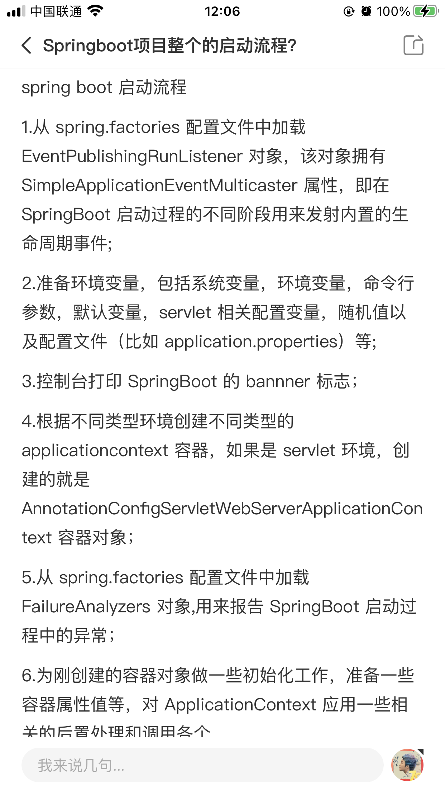


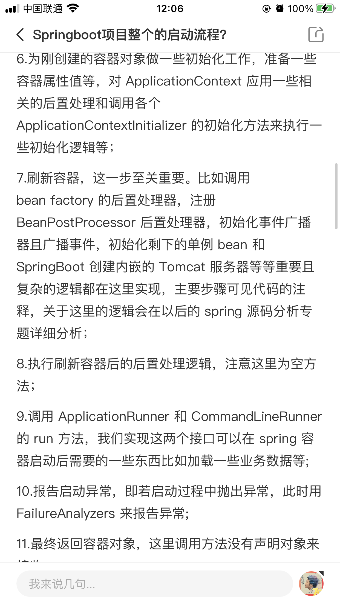


## Spring Boot 的核心注解是哪个？它主要由哪几个注解组成的？

启动类上面的注解是@SpringBootApplication，它也是 Spring Boot 的核心注解，主要组合包含了以下
3 个注解：
@SpringBootConfiguration：组合了 @Configuration 注解，实现配置文件的功能。
@EnableAutoConfiguration：打开自动配置的功能，也可以关闭某个自动配置的选项，如关闭数据源
自动配置功能： @SpringBootApplication(exclude = { DataSourceAutoConfiguration.class })。
@ComponentScan：Spring组件扫描


## 整合jsp

```xml
<!-- servlet依赖 -->
        <dependency>
              <groupId>javax.servlet</groupId>
              <artifactId>javax.servlet-api</artifactId>    
        </dependency>
        <dependency>
              <groupId>javax.servlet</groupId>
              <artifactId>jstl</artifactId>
        </dependency>
        <!-- tomcat的支持-->
        <dependency>
               <groupId>org.apache.tomcat.embed</groupId>
               <artifactId>tomcat-embed-jasper</artifactId>
        </dependency>
```


## 集成mybatis的过程

```xml
添加mybatis的starter maven依赖
 <dependency>
 <groupId>org.mybatis.spring.boot</groupId>
 <artifactId>mybatis-spring-boot-starter</artifactId>
 <version>1.2.0</version>
 </dependency>
 在mybatis的接口中 添加@Mapper注解
 在application.yml配置数据源信息
```


## 如何在Spring Boot启动的时候运行一些特定的代码？

如果你想在Spring Boot启动的时候运行一些特定的代码，你可以实现接口ApplicationRunner或者
CommandLineRunner，这两个接口实现方式一样，它们都只提供了一个run方法。
CommandLineRunner：启动获取命令行参数

## Spring Boot中的监视器是什么？

Spring boot actuator是spring启动框架中的重要功能之一。Spring boot监视器可帮助您访问生产环境
中正在运行的应用程序的当前状态。有几个指标必须在生产环境中进行检查和监控。即使一些外部应用
程序可能正在使用这些服务来向相关人员触发警报消息。监视器模块公开了一组可直接作为HTTP URL
访问的REST端点来检查状态。

## 如何使用Spring Boot实现异常处理？

Spring提供了一种使用ControllerAdvice处理异常的非常有用的方法。 我们通过实现一个
ControlerAdvice类，来处理控制器类抛出的所有异常。

## 你如何理解 Spring Boot 中的 Starters？

Starters可以理解为启动器，它包含了一系列可以集成到应用里面的依赖包，你可以一站式集成 Spring
及其他技术，而不需要到处找示例代码和依赖包。如你想使用 Spring JPA 访问数据库，只要加入
spring-boot-starter-data-jpa 启动器依赖就能使用了。

## springboot常用的starter有哪些

spring-boot-starter-web 嵌入tomcat和web开发需要servlet与jsp支持
spring-boot-starter-data-jpa 数据库支持
spring-boot-starter-data-redis redis数据库支持
spring-boot-starter-data-solr solr支持
mybatis-spring-boot-starter 第三方的mybatis集成starter


## 核心配置文件

核心配置文件是 application 和 bootstrap 配置文件。

application 配置文件这个容易理解，主要用于 Spring Boot 项目的自动化配置。

bootstrap 配置文件有以下几个应用场景。

1. 使用 Spring Cloud Config 配置中心时，这时需要在 bootstrap 配置文件中添加连接到配置中心的
   配置属性来加载外部配置中心的配置信息；
2. 一些固定的不能被覆盖的属性；
3. 一些加密/解密的场景；

## 核心注解是哪个？它主要由哪几个注解组成的？

启动类上面的注解是@SpringBootApplication，它也是 Spring Boot 的核心注解，主要组合包含了以下
3 个注解：
@SpringBootConfiguration：组合了 @Configuration 注解，实现配置文件的功能。
@EnableAutoConfiguration：打开自动配置的功能，也可以关闭某个自动配置的选项，如关闭数据源
自动配置功能： @SpringBootApplication(exclude = { DataSourceAutoConfiguration.class })。
@ComponentScan：Spring组件扫描。


## 依赖冲突的解决

先 最短路径 ，路径长度相同，先声明有效，后声明无效

### 1、路径优先原则

直接依赖优于传递依赖。如果传递依赖的Jar包版本冲突了，那么可以单独声明一个指定版本的依赖Jar包，即可解决冲突。例如，b引用了a的0.0.1版本，c引用了b的0.0.2版本，如果我们想用的版本是0.0.3版本，可以直接单独声明一个a的0.0.3版本。

### 2、第一声明原则

   在pom.xml配置文件中，如果有两个名称相同，版本的不同依赖声明，先写的会生效，所以先声明自己要用的版本。这里的名称相同，版本不同的依赖声明，既可以是直接依赖，也可以是传递依赖。

例如，b引用了a的0.0.1版本，c引用了b的0.0.2版本，如果我们想用的版本是0.0.1版本，那么可以将b的版本依赖放在c的前面。

### 3、排除原则

在发生传递依赖冲突时，如果依赖不是项目需要的，可以在对应的传递依赖声明中进行排除。例如，b引用了a的0.0.1版本，c引用了b的0.0.2版本，如果我们想用的版本是0.0.2版本，那么可以将b的版本依赖中排除a。
使用<dependency&gt的<exclusion>元素将会引起冲突的元素排除。


# dockers

## 什么是dockers？docker的优缺点

Docker是一个开源的应用容器引擎，是一个轻量级容器技术。

## docker与虚拟机的区别

虚拟机也是一种虚拟化技术，它与 Docker 最大的区别在于它是通过模拟硬件，并在硬件上安装操作系统来实现。

虚拟机是一个完整的操作系统，需要占用大量的磁盘、内存和 CPU 资源，一台机器只能开启几十个的虚拟机。
 而 Docker 只是一个进程，只需要将应用以及相关的组件打包，在运行时占用很少的资源，一台机器可以开启成千上万个 Docker。

## docker优点

1、部署方便

2、部署安全

3、隔离性好

4、快速回滚

5、成本低

6、管理成本更低

## docker缺点

1. 隔离性
2. 性能


# ngnix

## 什么是ngnix?ngnix的优缺点

Nginx(engine x) 是一个高性能的HTTP和反向代理服务，也是一个IMAP/POP3/SMTP服务。

## 优点

1.高并发量：根据官方给出的数据，能够支持高达 50,000 个并发连接数的响应

2.内存消耗少：处理静态文件，同样起web 服务，比apache 占用更少的内存及资源，所以它是轻量级的

3.简单稳定：配置简单，基本在一个conf文件中配置，性能比较稳定，可以7*24小时长时间不间断运行

4.模块化程度高：Nginx是高度模块化的设计，编写模块相对简单，包括 gzipping, byte ranges, chunked responses,以及 SSI-filter 等 filter，支持 SSL 和 TLSSNI。

5.支持Rwrite重写规则：能够根据域名、URL的不同， 将HTTP请求分发到不同的后端服务器群组。

6.低成本：Nginx可以做高并发的负载均衡，且Nginx是开源免费的，如果使用F5等硬件来做负载均衡，硬件成本比较高。

7.支持多系统：Nginx代码完全用C语言从头写成，已经移植到许多体系结构和操作系统，包括：Linux、FreeBSD、Solaris、Mac OS X、AIX以及Microsoft Windows，由于Nginx是免费开源的，可以在各系统上编译并使用。

## 缺点

1.动态处理差：nginx处理静态文件好,耗费内存少，但是处理动态页面则很鸡肋，现在一般前端用nginx作为反向代理抗住压力，apache作为后端处理动态请求。

2.rewrite弱：虽然nginx支持rewrite功能，但是相比于Apache来说，Apache比nginx 的rewrite 强大。


# Nginx负载均衡的算法怎么实现的?策略有哪些?

为了避免服务器崩溃，大家会通过负载均衡的方式来分担服务器压力。将对台服务器组成一个集群，当用户访问时，先访问到一个转发服务器，再由转发服务器将访问分发到压力更小的服务器。

Nginx负载均衡实现的策略有以下五种：

## 1 轮询(默认)

每个请求按时间顺序逐一分配到不同的后端服务器，如果后端某个服务器宕机，能自动剔除故障系统。

```
upstream backserver { 
 server 192.168.0.12; 
 server 192.168.0.13; 
} 

```

## 2 权重 weight

weight的值越大分配

到的访问概率越高，主要用于后端每台服务器性能不均衡的情况下。其次是为在主从的情况下设置不同的权值，达到合理有效的地利用主机资源。

```
upstream backserver { 
 server 192.168.0.12 weight=2; 
 server 192.168.0.13 weight=8; 
} 
```

权重越高，在被访问的概率越大，如上例，分别是20%，80%。

## 3 ip_hash( IP绑定)

每个请求按访问IP的哈希结果分配，使来自同一个IP的访客固定访问一台后端服务器，并且可以有效解决动态网页存在的session共享问题

```
upstream backserver { 
 ip_hash; 
 server 192.168.0.12:88; 
 server 192.168.0.13:80; 
} 
```

## 4 fair(第三方插件)

必须安装upstream_fair模块。

对比 weight、ip_hash更加智能的负载均衡算法，fair算法可以根据页面大小和加载时间长短智能地进行负载均衡，响应时间短的优先分配。

```
upstream backserver { 
 server server1; 
 server server2; 
 fair; 
} 
```

哪个服务器的响应速度快，就将请求分配到那个服务器上。

## 5、url_hash(第三方插件)

必须安装Nginx的hash软件包

按访问url的hash结果来分配请求，使每个url定向到同一个后端服务器，可以进一步提高后端缓存服务器的效率。

```
upstream backserver { 
 server squid1:3128; 
 server squid2:3128; 
 hash $request_uri; 
 hash_method crc32; 
} 
```

#

