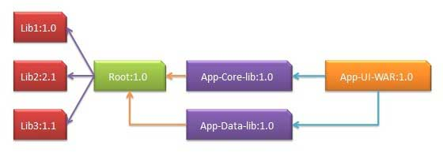

# redis

## 什么是redis？redis的优缺点

Redis的全称是：Remote Dictionary.Server，本质上是一个Key-Value类型的内存数据库，很像 memcached，整个数据库统统加载在内存当中进行操作，定期通过异步操作把数据库数据flush到硬盘 上进行保存。

Redis的优点
性能极高 – Redis能支持超过 100K+ 每秒的读写频率。
丰富的数据类型 – Redis支持二进制案例的 Strings, Lists, Hashes, Sets 及 Ordered Sets 数据类型操作。
原子 – Redis的所有操作都是原子性的，同时Redis还支持对几个操作全并后的原子性执行。
丰富的特性 – Redis还支持 publish/subscribe, 通知, key 过期等等特性。

Redis的缺点
 是数据库容量受到物理内存的限制,不能用作海量数据的高性能读写,因此Redis适合的场景主要局限在较小数据量的高性能操作和运算上。

 总结： Redis受限于特定的场景，专注于特定的领域之下，速度相当之快，目前还未找到能替代使用产品。

# dockers

## 什么是dockers？docker的优缺点

Docker是一个开源的应用容器引擎，是一个轻量级容器技术。

## docker与虚拟机的区别

虚拟机也是一种虚拟化技术，它与 Docker 最大的区别在于它是通过模拟硬件，并在硬件上安装操作系统来实现。

虚拟机是一个完整的操作系统，需要占用大量的磁盘、内存和 CPU 资源，一台机器只能开启几十个的虚拟机。
 而 Docker 只是一个进程，只需要将应用以及相关的组件打包，在运行时占用很少的资源，一台机器可以开启成千上万个 Docker。

## docker优点

1、部署方便

2、部署安全

3、隔离性好

4、快速回滚

5、成本低

6、管理成本更低

## docker缺点

1. 隔离性

2. 性能

## 常用命令


# Tomcat

## 什么是Tomcat?tomcat的优缺点


# ngnix

## 什么是ngnix?ngnix的优缺点

Nginx(engine x) 是一个高性能的HTTP和反向代理服务，也是一个IMAP/POP3/SMTP服务。

## 优点

1.高并发量：根据官方给出的数据，能够支持高达 50,000 个并发连接数的响应

2.内存消耗少：处理静态文件，同样起web 服务，比apache 占用更少的内存及资源，所以它是轻量级的

3.简单稳定：配置简单，基本在一个conf文件中配置，性能比较稳定，可以7*24小时长时间不间断运行

4.模块化程度高：Nginx是高度模块化的设计，编写模块相对简单，包括 gzipping, byte ranges, chunked responses,以及 SSI-filter 等 filter，支持 SSL 和 TLSSNI。

5.支持Rwrite重写规则：能够根据域名、URL的不同， 将HTTP请求分发到不同的后端服务器群组。

6.低成本：Nginx可以做高并发的负载均衡，且Nginx是开源免费的，如果使用F5等硬件来做负载均衡，硬件成本比较高。

7.支持多系统：Nginx代码完全用C语言从头写成，已经移植到许多体系结构和操作系统，包括：Linux、FreeBSD、Solaris、Mac OS X、AIX以及Microsoft Windows，由于Nginx是免费开源的，可以在各系统上编译并使用。

## 缺点

1.动态处理差：nginx处理静态文件好,耗费内存少，但是处理动态页面则很鸡肋，现在一般前端用nginx作为反向代理抗住压力，apache作为后端处理动态请求。

2.rewrite弱：虽然nginx支持rewrite功能，但是相比于Apache来说，Apache比nginx 的rewrite 强大。


# Maven

## 什么是maven?maven的优缺点


###  **优点如下：**

1. 简化了项目依赖管理：
2. 易于上手，对于新手可能一个"mvn clean package"命令就可能满足他的工作
3. 便于与持续集成工具（jenkins）整合
4. 便于项目升级，无论是项目本身升级还是项目使用的依赖升级。
5. 有助于多模块项目的开发，一个模块开发好后，发布到仓库，依赖该模块时可以直接从仓库更新，而不用自己去编译。
6. maven有很多插件，便于功能扩展，比如生产站点，自动发布版本等

###  **缺点如下：**

1. maven是一个庞大的构建系统，学习难度大
2. maven采用约定优于配置的策略（convention over configuration），虽然上手容易，但是一旦出了问题，难于调试。
3. 当依赖很多时，m2eclipse 老是搞得Eclipse很卡。
4. 中国的网络环境差，很多repository无法访问，比如google code， jboss 仓库无法访问等。

## Maven的生命周期

 maven有三套生命周期，分别为：

 1、clean 周期：主要用于清理上一次构建产生的文件，可以理解为删除target目录

 2、默认周期，
 主要阶段包含:

1. process-resources 默认处理src/test/resources/下的文件，将其输出到测试的classpath目录中,
2. compile 编译src/main/java下的java文件，产生对应的class,
3. process-test-resources 默认处理src/test/resources/下的文件，将其输出到测试的classpath目录中,
4. test-compile 编译src/test/java下的java文件，产生对应的class,
5. test 运行测试用例,
6. package 打包构件，即生成对应的jar, war等,
7. install将构件部署到本地仓库,
8. deploy 部署构件到远程仓库

 3、site周期

 主要阶段包含

- site 产生项目的站点文档
- site-deploy 将项目的站点文档部署到服务器

## 依赖机制

### 可传递性依赖发现

一种相当常见的情况，比如说 A 依赖于其他库 B。如果，另外一个项目 C 想要使用 A ，那么 C 项目也需要使用库 B。

Maven 可以避免去搜索所有所需库的需求。Maven 通过读取项目文件（pom.xml），找出它们项目之间的依赖关系。

我们需要做的只是在每个项目的 pom 中定义好直接的依赖关系。其他的事情 Maven 会帮我们搞定。

通过可传递性的依赖，所有被包含的库的图形会快速的增长。当有重复库时，可能出现的情形将会持续上升。Maven 提供一些功能来控制可传递的依赖的程度。

| 功能     | 功能描述                                                     |
| -------- | ------------------------------------------------------------ |
| 依赖调节 | 决定当多个手动创建的版本同时出现时，哪个依赖版本将会被使用。 如果两个依赖版本在依赖树里的深度是一样的时候，第一个被声明的依赖将会被使用。 |
| 依赖管理 | 直接的指定手动创建的某个版本被使用。例如当一个工程 C 在自己的依赖管理模块包含工程 B，即 B 依赖于 A， 那么 A 即可指定在 B 被引用时所使用的版本。 |
| 依赖范围 | 包含在构建过程每个阶段的依赖。                               |
| 依赖排除 | 任何可传递的依赖都可以通过 "exclusion" 元素被排除在外。举例说明，A 依赖 B， B 依赖 C，因此 A 可以标记 C 为 "被排除的"。 |
| 依赖可选 | 任何可传递的依赖可以被标记为可选的，通过使用 "optional" 元素。例如：A 依赖 B， B 依赖 C。因此，B 可以标记 C 为可选的， 这样 A 就可以不再使用 C。 |

------

### 依赖范围

传递依赖发现可以通过使用如下的依赖范围来得到限制：

| 范围     | 描述                                                         |
| -------- | ------------------------------------------------------------ |
| 编译阶段 | 该范围表明相关依赖是只在项目的类路径下有效。默认取值。       |
| 供应阶段 | 该范围表明相关依赖是由运行时的 JDK 或者 网络服务器提供的。   |
| 运行阶段 | 该范围表明相关依赖在编译阶段不是必须的，但是在执行阶段是必须的。 |
| 测试阶段 | 该范围表明相关依赖只在测试编译阶段和执行阶段。               |
| 系统阶段 | 该范围表明你需要提供一个系统路径。                           |
| 导入阶段 | 该范围只在依赖是一个 pom 里定义的依赖时使用。同时，当前项目的POM 文件的  部分定义的依赖关系可以取代某特定的 POM。 |

------

### 依赖管理

通常情况下，在一个共通的项目下，有一系列的项目。在这种情况下，我们可以创建一个公共依赖的 pom 文件，该 pom 包含所有的公共的依赖关系，我们称其为其他子项目 pom 的 pom 父。 接下来的一个例子可以帮助你更好的理解这个概念。



接下来是上面依赖图的详情说明：

- App-UI-WAR 依赖于 App-Core-lib 和 App-Data-lib。
- Root 是 App-Core-lib 和 App-Data-lib 的父项目。
- Root 在它的依赖部分定义了 Lib1、lib2 和 Lib3 作为依赖。

## 依赖冲突的解决

### 1、第一声明原则

   在pom.xml配置文件中，如果有两个名称相同，版本的不同依赖声明，先写的会生效，所以先声明自己要用的版本。这里的名称相同，版本不同的依赖声明，既可以是直接依赖，也可以是传递依赖。

例如，b引用了a的0.0.1版本，c引用了b的0.0.2版本，如果我们想用的版本是0.0.1版本，那么可以将b的版本依赖放在c的前面。

### 2、路径优先原则

直接依赖优于传递依赖。如果传递依赖的Jar包版本冲突了，那么可以单独声明一个指定版本的依赖Jar包，即可解决冲突。例如，b引用了a的0.0.1版本，c引用了b的0.0.2版本，如果我们想用的版本是0.0.3版本，可以直接单独声明一个a的0.0.3版本。

### 3、排除原则

在发生传递依赖冲突时，如果依赖不是项目需要的，可以在对应的传递依赖声明中进行排除。例如，b引用了a的0.0.1版本，c引用了b的0.0.2版本，如果我们想用的版本是0.0.2版本，那么可以将b的版本依赖中排除a。
使用<dependency&gt的<exclusion>元素将会引起冲突的元素排除。


# JVM

## JMM

JMM即Java内存模型(Java memory model)，在JSR133里指出了JMM是用来定义一个**一致的、跨平台**的内存模型，是缓存一致性协议，用来定义数据读写的规则。

### 内存可见性

在Java中，不同线程拥有各自的私有**工作内存**，当线程需要读取或修改某个变量时，不能直接去操作**主内存**中的变量，而是需要将这个变量读取到线程的**工作内存**的**变量副本**中，当该线程修改其变量副本的值后，**其它线程并不能立刻读取到新值**，需要将修改后的值**刷新到主内存中**，其它线程才能**从主内存读取到修改后的值**。


### 指令重排序

在执行程序时为了提高性能，编译器和处理器常常会对指令做重排序，指令重排序使得代码在**多线程**执行时会出现一些问题。

其中最著名的案例便是在**初始化单例时**由于**可见性**和**重排序**导致的错误。

单例模式

#### 案例1

```java
public class Singleton {
    private static Singleton singleton;
    private Singleton() {
    }
    public static Singleton getInstance() {
        if (singleton == null) {
            singleton = new Singleton();
        }
        return singleton;
    }
}
复制代码
```

以上代码是经典的**懒汉式**单例实现，但在多线程的情况下，多个线程有可能会同时进入`if (singleton == null)` ，从而执行了多次`singleton = new Singleton()`，从而破坏单例。

#### 案例2

```java
public class Singleton {
    private static Singleton singleton;
    private Singleton() {
    }
    public static Singleton getInstance() {
        if (singleton == null) {
            synchronized (Singleton.class) {
                if (singleton == null) {
                    singleton = new Singleton();
                }
            }
        }
        return singleton;
    }
}
复制代码
```

以上代码在检测到`singleton`为null后，会在同步块中再次判断，可以保证同一时间只有一个线程可以初始化单例。但仍然存在问题，原因就是Java中`singleton = new Singleton()`语句并不是一个**原子指令**，而是由三步组成：

1. 为对象分配内存
2. 初始化对象
3. 将对象的内存地址赋给引用

但是当经过**指令重排序**后，会变成：

1. 为对象分配内存
2. 将对象的内存地址赋给引用（会使得singleton != null）
3. 初始化对象

所以就存在一种情况，当线程A已经将内存地址赋给引用时，但**实例对象并没有完全初始化**，同时线程B判断`singleton`已经不为null，就会导致B线程**访问到未初始化的变量**从而产生错误。

#### 案例3

```java
public class Singleton {
    private static volatile Singleton singleton;
    private Singleton() {
    }
    public static Singleton getInstance() {
        if (singleton == null) {
            synchronized (Singleton.class) {
                if (singleton == null) {
                    singleton = new Singleton();
                }
            }
        }
        return singleton;
    }
}
复制代码
```

以上代码对`singleton`变量添加了`volatile`修饰，可以阻止**局部指令重排序**。


# 多线程与高并发

## volatile

volatile的作用就是当一个线程更新某个volatile声明的变量时，会通知其他的cpu使缓存失效，从而其他cpu想要做更新操作时，需要从内存重新读取数据

### 原理

1. 规定线程每次修改变量副本后**立刻同步到主内存**中，用于保证其它线程可以看到自己对变量的修改
2. 规定线程每次使用变量前，先从主内存中**刷新最新的值**到工作内存，用于保证能看见其它线程对变量修改的最新值
3. 为了实现可见性内存语义，编译器在生成字节码时，会在指令序列中插入**内存屏障**来**防止指令重排序**。

### 注意：

1. volatile只能保证基本类型变量的内存可见性，对于引用类型，无法保证引用所指向的**实际对象内部数据**的内存可见性。关于引用变量类型详见：[Java的数据类型](https://mp.weixin.qq.com/s/FqrnDcPt4a5SS8eTRffJdQ)。
2. volilate只能保证共享对象的**可见性**，不能保证**原子性**：假设两个线程同时在做x++，在线程A修改共享变量从0到1的同时，线程B**已经正在使用**值为0的变量，所以这时候**可见性已经无法发挥作用**，线程B将其修改为1，所以最后结果是1而不是2。

### 为什么volatile可以保证变量的可见性和阻止指令重排序？


### volatile案例

```java
public class Singleton {
    private static volatile Singleton singleton;
    private Singleton() {
    }
    public static Singleton getInstance() {
        if (singleton == null) {
            synchronized (Singleton.class) {
                if (singleton == null) {
                    singleton = new Singleton();
                }
            }
        }
        return singleton;
    }
}
复制代码
```

以上代码对`singleton`变量添加了`volatile`修饰，可以阻止**局部指令重排序**。


# 网络

## 三次握手

​    所谓三次握手（Three-Way Handshake）即建立TCP连接，就是指建立一个TCP连接时，需要客户端和服务端总共发送3个包以确认连接的建立。在socket编程中，这一过程由客户端执行connect来触发，整个流程如下图所示：

  
图2 TCP三次握手

​    （1）第一次握手：Client将标志位SYN置为1，随机产生一个值seq=J，并将该数据包发送给Server，Client进入SYN_SENT状态，等待Server确认。
​      （2）第二次握手：Server收到数据包后由标志位SYN=1知道Client请求建立连接，Server将标志位SYN和ACK都置为1，ack=J+1，随机产生一个值seq=K，并将该数据包发送给Client以确认连接请求，Server进入SYN_RCVD状态。
​      （3）第三次握手：Client收到确认后，检查ack是否为J+1，ACK是否为1，如果正确则将标志位ACK置为1，ack=K+1，并将该数据包发送给Server，Server检查ack是否为K+1，ACK是否为1，如果正确则连接建立成功，Client和Server进入ESTABLISHED状态，完成三次握手，随后Client与Server之间可以开始传输数据了。

## 四次挥手

​     三次握手耳熟能详，四次挥手估计就，所谓四次挥手（Four-Way Wavehand）即终止TCP连接，就是指断开一个TCP连接时，需要客户端和服务端总共发送4个包以确认连接的断开。在socket编程中，这一过程由客户端或服务端任一方执行close来触发，整个流程如下图所示：

  
图3 TCP四次挥手

​      由于TCP连接时全双工的，因此，每个方向都必须要单独进行关闭，这一原则是当一方完成数据发送任务后，发送一个FIN来终止这一方向的连接，收到一个FIN只是意味着这一方向上没有数据流动了，即不会再收到数据了，但是在这个TCP连接上仍然能够发送数据，直到这一方向也发送了FIN。首先进行关闭的一方将执行主动关闭，而另一方则执行被动关闭，上图描述的即是如此。
​    （1）第一次挥手：Client发送一个FIN，用来关闭Client到Server的数据传送，Client进入FIN_WAIT_1状态。
​    （2）第二次挥手：Server收到FIN后，发送一个ACK给Client，确认序号为收到序号+1（与SYN相同，一个FIN占用一个序号），Server进入CLOSE_WAIT状态。
​    （3）第三次挥手：Server发送一个FIN，用来关闭Server到Client的数据传送，Server进入LAST_ACK状态。
​    （4）第四次挥手：Client收到FIN后，Client进入TIME_WAIT状态，接着发送一个ACK给Server，确认序号为收到序号+1，Server进入CLOSED状态，完成四次挥手。

## 为什么建立连接是三次握手，而关闭连接却是四次挥手呢？

​      这是因为服务端在LISTEN状态下，收到建立连接请求的SYN报文后，把ACK和SYN放在一个报文里发送给客户端。而关闭连接时，当收到对方的FIN报文时，仅仅表示对方不再发送数据了但是还能接收数据，己方也未必全部数据都发送给对方了，所以己方可以立即close，也可以发送一些数据给对方后，再发送FIN报文给对方来表示同意现在关闭连接，因此，己方ACK和FIN一般都会分开发送。


## 输入url到加载完页面发生了什么

1. DNS解析
2. TCP连接
3. 发送HTTP请求
4. 服务器处理请求并返回HTTP报文
5. 浏览器解析渲染页面
6. 连接结束


#  Restful风格

## 什么是 Restful风格


# Servlet


# spring 、spring MVC


# spring boot