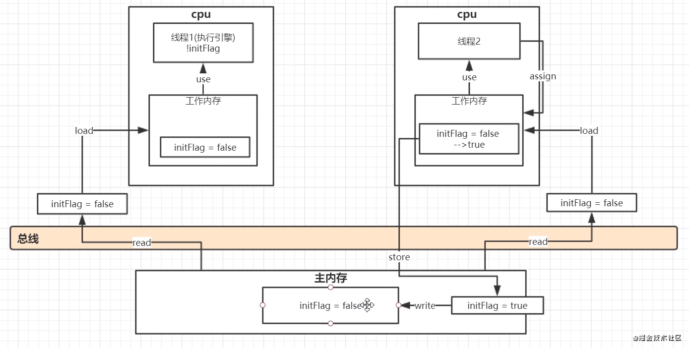
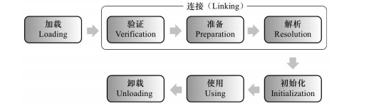

# redis

## 什么是redis？redis的优缺点

Redis的全称是：Remote Dictionary.Server，本质上是一个Key-Value类型的内存数据库，很像 memcached，整个数据库统统加载在内存当中进行操作，定期通过异步操作把数据库数据flush到硬盘 上进行保存。

Redis的优点
性能极高 – Redis能支持超过 100K+ 每秒的读写频率。
丰富的数据类型 – Redis支持二进制案例的 Strings, Lists, Hashes, Sets 及 Ordered Sets 数据类型操作。
原子 – Redis的所有操作都是原子性的，同时Redis还支持对几个操作全并后的原子性执行。
丰富的特性 – Redis还支持 publish/subscribe, 通知, key 过期等等特性。

Redis的缺点
 是数据库容量受到物理内存的限制,不能用作海量数据的高性能读写,因此Redis适合的场景主要局限在较小数据量的高性能操作和运算上。

 总结： Redis受限于特定的场景，专注于特定的领域之下，速度相当之快，目前还未找到能替代使用产品。


## 主从复制


## 集群

### 集群方案

### 集群问题


## Redis 为什么是单线程的

官方FAQ表示，因为Redis是基于内存的操作，CPU不是Redis的瓶颈，Redis的瓶颈最有可能是机器内
存的大小或者网络带宽。既然单线程容易实现，而且CPU不会成为瓶颈，那就顺理成章地采用单线程的
方案了（毕竟采用多线程会有很多麻烦！）Redis利用队列技术将并发访问变为串行访问
1）绝大部分请求是纯粹的内存操作（非常快速）2）采用单线程,避免了不必要的上下文切换和竞争条
件
3）非阻塞IO优点：
速度快，因为数据存在内存中，类似于HashMap，HashMap的优势就是查找和操作的时间复杂度
都是O(1)
支持丰富数据类型，支持string，list，set，sorted set，hash
支持事务，操作都是原子性，所谓的原子性就是对数据的更改要么全部执行，要么全部不执行
丰富的特性：可用于缓存，消息，按key设置过期时间，过期后将会自动删除如何解决redis的并发
竞争key问题
同时有多个子系统去set一个key。这个时候要注意什么呢？ 不推荐使用redis的事务机制。因为我们的
生产环境，基本都是redis集群环境，做了数据分片操作。你一个事务中有涉及到多个key操作的时候，
这多个key不一定都存储在同一个redis-server上。因此，redis的事务机制，十分鸡肋。
(1)如果对这个key操作，不要求顺序： 准备一个分布式锁，大家去抢锁，抢到锁就做set操作即可
(2)如果对这个key操作，要求顺序： 分布式锁+时间戳。 假设这会系统B先抢到锁，将key1设置为
{valueB 3:05}。接下来系统A抢到锁，发现自己的valueA的时间戳早于缓存中的时间戳，那就不做set操作了。以此类推。
(3) 利用队列，将set方法变成串行访问也可以redis遇到高并发，如果保证读写key的一致性
对redis的操作都是具有原子性的,是线程安全的操作,你不用考虑并发问题,redis内部已经帮你处理好并
发的问题了。


## Redis事务

Redis事务功能是通过MULTI、EXEC、DISCARD和WATCH 四个原语实现的
Redis会将一个事务中的所有命令序列化，然后按顺序执行。
1.redis 不支持回滚“Redis 在事务失败时不进行回滚，而是继续执行余下的命令”， 所以 Redis 的内部可
以保持简单且快速。
2.如果在一个事务中的命令出现错误，那么所有的命令都不会执行；
3.如果在一个事务中出现运行错误，那么正确的命令会被执行。
1）MULTI命令用于开启一个事务，它总是返回OK。 MULTI执行之后，客户端可以继续向服务器发送任
意多条命令，这些命令不会立即被执行，而是被放到一个队列中，当EXEC命令被调用时，所有队列中
的命令才会被执行。
2）EXEC：执行所有事务块内的命令。返回事务块内所有命令的返回值，按命令执行的先后顺序排列。
当操作被打断时，返回空值 nil 。
3）通过调用DISCARD，客户端可以清空事务队列，并放弃执行事务， 并且客户端会从事务状态中退
出。
4）WATCH 命令可以为 Redis 事务提供 check-and-set （CAS）行为。 可以监控一个或多个键，一旦其
中有一个键被修改（或删除），之后的事务就不会执行，监控一直持续到EXEC命令。

## Redis 常见性能问题和解决方案？

(1) Master 最好不要做任何持久化工作，如 RDB 内存快照和 AOF 日志文件
(2) 如果数据比较重要，某个 Slave 开启 AOF 备份数据，策略设置为每秒同步一次
(3) 为了主从复制的速度和连接的稳定性， Master 和 Slave 最好在同一个局域网内
(4) 尽量避免在压力很大的主库上增加从库
(5) 主从复制不要用图状结构，用单向链表结构更为稳定，即： Master <- Slave1 <- Slave2<Slave3

## 提问


# RabbitＭＱ

## 提问

# dockers

## 什么是dockers？docker的优缺点

Docker是一个开源的应用容器引擎，是一个轻量级容器技术。

## docker与虚拟机的区别

虚拟机也是一种虚拟化技术，它与 Docker 最大的区别在于它是通过模拟硬件，并在硬件上安装操作系统来实现。

虚拟机是一个完整的操作系统，需要占用大量的磁盘、内存和 CPU 资源，一台机器只能开启几十个的虚拟机。
 而 Docker 只是一个进程，只需要将应用以及相关的组件打包，在运行时占用很少的资源，一台机器可以开启成千上万个 Docker。

## docker优点

1、部署方便

2、部署安全

3、隔离性好

4、快速回滚

5、成本低

6、管理成本更低

## docker缺点

1. 隔离性

2. 性能

## 常用命令


## 提问


# Tomcat

## 什么是Tomcat?tomcat的优缺点

## 提问

# ngnix

## 什么是ngnix?ngnix的优缺点

Nginx(engine x) 是一个高性能的HTTP和反向代理服务，也是一个IMAP/POP3/SMTP服务。

## 优点

1.高并发量：根据官方给出的数据，能够支持高达 50,000 个并发连接数的响应

2.内存消耗少：处理静态文件，同样起web 服务，比apache 占用更少的内存及资源，所以它是轻量级的

3.简单稳定：配置简单，基本在一个conf文件中配置，性能比较稳定，可以7*24小时长时间不间断运行

4.模块化程度高：Nginx是高度模块化的设计，编写模块相对简单，包括 gzipping, byte ranges, chunked responses,以及 SSI-filter 等 filter，支持 SSL 和 TLSSNI。

5.支持Rwrite重写规则：能够根据域名、URL的不同， 将HTTP请求分发到不同的后端服务器群组。

6.低成本：Nginx可以做高并发的负载均衡，且Nginx是开源免费的，如果使用F5等硬件来做负载均衡，硬件成本比较高。

7.支持多系统：Nginx代码完全用C语言从头写成，已经移植到许多体系结构和操作系统，包括：Linux、FreeBSD、Solaris、Mac OS X、AIX以及Microsoft Windows，由于Nginx是免费开源的，可以在各系统上编译并使用。

## 缺点

1.动态处理差：nginx处理静态文件好,耗费内存少，但是处理动态页面则很鸡肋，现在一般前端用nginx作为反向代理抗住压力，apache作为后端处理动态请求。

2.rewrite弱：虽然nginx支持rewrite功能，但是相比于Apache来说，Apache比nginx 的rewrite 强大。


## 提问

# Maven

## 什么是maven?maven的优缺点


###  **优点如下：**

1. 简化了项目依赖管理：
2. 易于上手，对于新手可能一个"mvn clean package"命令就可能满足他的工作
3. 便于与持续集成工具（jenkins）整合
4. 便于项目升级，无论是项目本身升级还是项目使用的依赖升级。
5. 有助于多模块项目的开发，一个模块开发好后，发布到仓库，依赖该模块时可以直接从仓库更新，而不用自己去编译。
6. maven有很多插件，便于功能扩展，比如生产站点，自动发布版本等

###  **缺点如下：**

1. maven是一个庞大的构建系统，学习难度大
2. maven采用约定优于配置的策略（convention over configuration），虽然上手容易，但是一旦出了问题，难于调试。
3. 当依赖很多时，m2eclipse 老是搞得Eclipse很卡。
4. 中国的网络环境差，很多repository无法访问，比如google code， jboss 仓库无法访问等。

## Maven的生命周期

 maven有三套生命周期，分别为：

 1、clean 周期：主要用于清理上一次构建产生的文件，可以理解为删除target目录

 2、默认周期，
 主要阶段包含:

1. process-resources 默认处理src/test/resources/下的文件，将其输出到测试的classpath目录中,
2. compile 编译src/main/java下的java文件，产生对应的class,
3. process-test-resources 默认处理src/test/resources/下的文件，将其输出到测试的classpath目录中,
4. test-compile 编译src/test/java下的java文件，产生对应的class,
5. test 运行测试用例,
6. package 打包构件，即生成对应的jar, war等,
7. install将构件部署到本地仓库,
8. deploy 部署构件到远程仓库

 3、site周期

 主要阶段包含

- site 产生项目的站点文档
- site-deploy 将项目的站点文档部署到服务器

## 依赖机制

### 可传递性依赖发现

一种相当常见的情况，比如说 A 依赖于其他库 B。如果，另外一个项目 C 想要使用 A ，那么 C 项目也需要使用库 B。

Maven 可以避免去搜索所有所需库的需求。Maven 通过读取项目文件（pom.xml），找出它们项目之间的依赖关系。

我们需要做的只是在每个项目的 pom 中定义好直接的依赖关系。其他的事情 Maven 会帮我们搞定。

通过可传递性的依赖，所有被包含的库的图形会快速的增长。当有重复库时，可能出现的情形将会持续上升。Maven 提供一些功能来控制可传递的依赖的程度。

| 功能     | 功能描述                                                     |
| -------- | ------------------------------------------------------------ |
| 依赖调节 | 决定当多个手动创建的版本同时出现时，哪个依赖版本将会被使用。 如果两个依赖版本在依赖树里的深度是一样的时候，第一个被声明的依赖将会被使用。 |
| 依赖管理 | 直接的指定手动创建的某个版本被使用。例如当一个工程 C 在自己的依赖管理模块包含工程 B，即 B 依赖于 A， 那么 A 即可指定在 B 被引用时所使用的版本。 |
| 依赖范围 | 包含在构建过程每个阶段的依赖。                               |
| 依赖排除 | 任何可传递的依赖都可以通过 "exclusion" 元素被排除在外。举例说明，A 依赖 B， B 依赖 C，因此 A 可以标记 C 为 "被排除的"。 |
| 依赖可选 | 任何可传递的依赖可以被标记为可选的，通过使用 "optional" 元素。例如：A 依赖 B， B 依赖 C。因此，B 可以标记 C 为可选的， 这样 A 就可以不再使用 C。 |

------

### 依赖范围

传递依赖发现可以通过使用如下的依赖范围来得到限制：

| 范围     | 描述                                                         |
| -------- | ------------------------------------------------------------ |
| 编译阶段 | 该范围表明相关依赖是只在项目的类路径下有效。默认取值。       |
| 供应阶段 | 该范围表明相关依赖是由运行时的 JDK 或者 网络服务器提供的。   |
| 运行阶段 | 该范围表明相关依赖在编译阶段不是必须的，但是在执行阶段是必须的。 |
| 测试阶段 | 该范围表明相关依赖只在测试编译阶段和执行阶段。               |
| 系统阶段 | 该范围表明你需要提供一个系统路径。                           |
| 导入阶段 | 该范围只在依赖是一个 pom 里定义的依赖时使用。同时，当前项目的POM 文件的  部分定义的依赖关系可以取代某特定的 POM。 |

------

### 依赖管理

通常情况下，在一个共通的项目下，有一系列的项目。在这种情况下，我们可以创建一个公共依赖的 pom 文件，该 pom 包含所有的公共的依赖关系，我们称其为其他子项目 pom 的 pom 父。 接下来的一个例子可以帮助你更好的理解这个概念。


接下来是上面依赖图的详情说明：

- App-UI-WAR 依赖于 App-Core-lib 和 App-Data-lib。
- Root 是 App-Core-lib 和 App-Data-lib 的父项目。
- Root 在它的依赖部分定义了 Lib1、lib2 和 Lib3 作为依赖。

## 依赖冲突的解决

### 1、第一声明原则

   在pom.xml配置文件中，如果有两个名称相同，版本的不同依赖声明，先写的会生效，所以先声明自己要用的版本。这里的名称相同，版本不同的依赖声明，既可以是直接依赖，也可以是传递依赖。

例如，b引用了a的0.0.1版本，c引用了b的0.0.2版本，如果我们想用的版本是0.0.1版本，那么可以将b的版本依赖放在c的前面。

### 2、路径优先原则

直接依赖优于传递依赖。如果传递依赖的Jar包版本冲突了，那么可以单独声明一个指定版本的依赖Jar包，即可解决冲突。例如，b引用了a的0.0.1版本，c引用了b的0.0.2版本，如果我们想用的版本是0.0.3版本，可以直接单独声明一个a的0.0.3版本。

### 3、排除原则

在发生传递依赖冲突时，如果依赖不是项目需要的，可以在对应的传递依赖声明中进行排除。例如，b引用了a的0.0.1版本，c引用了b的0.0.2版本，如果我们想用的版本是0.0.2版本，那么可以将b的版本依赖中排除a。
使用<dependency&gt的<exclusion>元素将会引起冲突的元素排除。


## 提问

# JVM

## JMM

JMM即Java内存模型(Java memory model)，在JSR133里指出了JMM是用来定义一个**一致的、跨平台**的内存模型，是缓存一致性协议，用来定义数据读写的规则。

### 内存可见性

在Java中，不同线程拥有各自的私有**工作内存**，当线程需要读取或修改某个变量时，不能直接去操作**主内存**中的变量，而是需要将这个变量读取到线程的**工作内存**的**变量副本**中，当该线程修改其变量副本的值后，**其它线程并不能立刻读取到新值**，需要将修改后的值**刷新到主内存中**，其它线程才能**从主内存读取到修改后的值**。




### 指令重排序

在执行程序时为了提高性能，编译器和处理器常常会对指令做重排序，指令重排序使得代码在**多线程**执行时会出现一些问题。

其中最著名的案例便是在**初始化单例时**由于**可见性**和**重排序**导致的错误。

单例模式

#### 案例1

```java
public class Singleton {
    private static Singleton singleton;
    private Singleton() {
    }
    public static Singleton getInstance() {
        if (singleton == null) {
            singleton = new Singleton();
        }
        return singleton;
    }
}
复制代码
```

以上代码是经典的**懒汉式**单例实现，但在多线程的情况下，多个线程有可能会同时进入`if (singleton == null)` ，从而执行了多次`singleton = new Singleton()`，从而破坏单例。

#### 案例2

```java
public class Singleton {
    private static Singleton singleton;
    private Singleton() {
    }
    public static Singleton getInstance() {
        if (singleton == null) {
            synchronized (Singleton.class) {
                if (singleton == null) {
                    singleton = new Singleton();
                }
            }
        }
        return singleton;
    }
}
复制代码
```

以上代码在检测到`singleton`为null后，会在同步块中再次判断，可以保证同一时间只有一个线程可以初始化单例。但仍然存在问题，原因就是Java中`singleton = new Singleton()`语句并不是一个**原子指令**，而是由三步组成：

1. 为对象分配内存
2. 初始化对象
3. 将对象的内存地址赋给引用

但是当经过**指令重排序**后，会变成：

1. 为对象分配内存
2. 将对象的内存地址赋给引用（会使得singleton != null）
3. 初始化对象

所以就存在一种情况，当线程A已经将内存地址赋给引用时，但**实例对象并没有完全初始化**，同时线程B判断`singleton`已经不为null，就会导致B线程**访问到未初始化的变量**从而产生错误。

#### 案例3

```java
public class Singleton {
    private static volatile Singleton singleton;
    private Singleton() {
    }
    public static Singleton getInstance() {
        if (singleton == null) {
            synchronized (Singleton.class) {
                if (singleton == null) {
                    singleton = new Singleton();
                }
            }
        }
        return singleton;
    }
}
复制代码
```

以上代码对`singleton`变量添加了`volatile`修饰，可以阻止**局部指令重排序**。


## 类的加载机制




其中验证,准备,解析合称链接
加载通过类的完全限定名,查找此类字节码文件,利用字节码文件创建Class对象.
验证确保Class文件符合当前虚拟机的要求,不会危害到虚拟机自身安全.
准备进行内存分配,为static修饰的类变量分配内存,并设置初始值(0或null).不包含final修饰的静态变量,
因为final变量在编译时分配.
解析将常量池中的符号引用替换为直接引用的过程.直接引用为直接指向目标的指针或者相对偏移量等.
初始化主要完成静态块执行以及静态变量的赋值.先初始化父类,再初始化当前类.只有对类主动使用时才
会初始化.
触发条件包括,创建类的实例时,访问类的静态方法或静态变量的时候,使用Class.forName反射类的时候,
或者某个子类初始化的时候.
Java自带的加载器加载的类,在虚拟机的生命周期中是不会被卸载的,只有用户自定义的加载器加载的类
才可以被卸.


## Java 的类加载器的种类都有哪些？

1、根类加载器(Bootstrap) --C++写的 ，看不到源码
2、扩展类加载器（Extension） --加载位置 ：jre\lib\ext 中

3、系统(应用)类加载器(System\App) --加载位置 ：classpath 中
4、自定义加载器(必须继承 ClassLoader)

## 类什么时候被初始化？

1）创建类的实例，也就是 new 一个对象
2）访问某个类或接口的静态变量，或者对该静态变量赋值
3）调用类的静态方法
4）反射（Class.forName("com.lyj.load")）
5）初始化一个类的子类（会首先初始化子类的父类）
6）JVM 启动时标明的启动类，即文件名和类名相同的那个类
 只有这 6 中情况才会导致类的类的初始化。
 类的初始化步骤：
 1）如果这个类还没有被加载和链接，那先进行加载和链接
 2）假如这个类存在直接父类，并且这个类还没有被初始化（注意：在一个类加载器中，类只能初始化一
次），那就初始化直接的父类（不适用于接口）
 3)加入类中存在初始化语句（如 static 变量和 static 块），那就依次执行这些初始化语句。


## Java对象创建过程

1.JVM遇到一条新建对象的指令时首先去检查这个指令的参数是否能在常量池中定义到一个类的符号引
用。然后加载这个类（类加载过程在后边讲）
2.为对象分配内存。一种办法“指针碰撞”、一种办法“空闲列表”，最终常用的办法“本地线程缓冲分配
(TLAB)”
3.将除对象头外的对象内存空间初始化为0
4.对对象头进行必要设置


## 如何判断对象可以被回收？

判断对象是否存活一般有两种方式：
引用计数：每个对象有一个引用计数属性，新增一个引用时计数加1，引用释放时计数减1，计数
为0时可以回收。此方法简单，无法解决对象相互循环引用的问题。
可达性分析（Reachability Analysis）：从GC Roots开始向下搜索，搜索所走过的路径称为引用
链。当一个对象到GC Roots没有任何引用链相连时，则证明此对象是不可用的，不可达对象。

## 垃圾收集算法

GC最基础的算法有三种： 标记 -清除算法、复制算法、标记-压缩算法，我们常用的垃圾回收器一般都
采用分代收集算法。
标记 -清除算法，“标记-清除”（Mark-Sweep）算法，如它的名字一样，算法分为“标记”和“清除”两
个阶段：首先标记出所有需要回收的对象，在标记完成后统一回收掉所有被标记的对象。
复制算法，“复制”（Copying）的收集算法，它将可用内存按容量划分为大小相等的两块，每次只
使用其中的一块。当这一块的内存用完了，就将还存活着的对象复制到另外一块上面，然后再把已
使用过的内存空间一次清理掉。
标记-压缩算法，标记过程仍然与“标记-清除”算法一样，但后续步骤不是直接对可回收对象进行清
理，而是让所有存活的对象都向一端移动，然后直接清理掉端边界以外的内存
分代收集算法，“分代收集”（Generational Collection）算法，把Java堆分为新生代和老年代，这
样就可以根据各个年代的特点采用最适当的收集算法。

## Minor GC与Full GC分别在什么时候发生？

新生代内存不够用时候发生MGC也叫YGC，JVM内存不够的时候发生FGC


## 简述Java的对象结构

Java对象由三个部分组成：对象头、实例数据、对齐填充。
对象头由两部分组成，第一部分存储对象自身的运行时数据：哈希码、GC分代年龄、锁标识状态、线
程持有的锁、偏向线程ID（一般占32/64 bit）。第二部分是指针类型，指向对象的类元数据类型（即对
象代表哪个类）。如果是数组对象，则对象头中还有一部分用来记录数组长度。
实例数据用来存储对象真正的有效信息（包括父类继承下来的和自己定义的）
对齐填充：JVM要求对象起始地址必须是8字节的整数倍（8字节对齐）


你知道哪些JVM性能调优
设定堆内存大小
-Xmx：堆内存最大限制。
设定新生代大小。 新生代不宜太小，否则会有大量对象涌入老年代

-XX:NewSize：新生代大小
-XX:NewRatio 新生代和老生代占比
-XX:SurvivorRatio：伊甸园空间和幸存者空间的占比
设定垃圾回收器 年轻代用 -XX:+UseParNewGC 年老代用-XX:+UseConcMarkSweepGC

## 提问

# 多线程与高并发

## volatile

volatile的作用就是当一个线程更新某个volatile声明的变量时，会通知其他的cpu使缓存失效，从而其他cpu想要做更新操作时，需要从内存重新读取数据

### 原理

1. 规定线程每次修改变量副本后**立刻同步到主内存**中，用于保证其它线程可以看到自己对变量的修改
2. 规定线程每次使用变量前，先从主内存中**刷新最新的值**到工作内存，用于保证能看见其它线程对变量修改的最新值
3. 为了实现可见性内存语义，编译器在生成字节码时，会在指令序列中插入**内存屏障**来**防止指令重排序**。

### 注意：

1. volatile只能保证基本类型变量的内存可见性，对于引用类型，无法保证引用所指向的**实际对象内部数据**的内存可见性。关于引用变量类型详见：[Java的数据类型](https://mp.weixin.qq.com/s/FqrnDcPt4a5SS8eTRffJdQ)。
2. volilate只能保证共享对象的**可见性**，不能保证**原子性**：假设两个线程同时在做x++，在线程A修改共享变量从0到1的同时，线程B**已经正在使用**值为0的变量，所以这时候**可见性已经无法发挥作用**，线程B将其修改为1，所以最后结果是1而不是2。

### 为什么volatile可以保证变量的可见性和阻止指令重排序？


### volatile案例

```java
public class Singleton {
    private static volatile Singleton singleton;
    private Singleton() {
    }
    public static Singleton getInstance() {
        if (singleton == null) {
            synchronized (Singleton.class) {
                if (singleton == null) {
                    singleton = new Singleton();
                }
            }
        }
        return singleton;
    }
}
复制代码
```

以上代码对`singleton`变量添加了`volatile`修饰，可以阻止**局部指令重排序**。

## 线程 B 怎么知道线程 A 修改了变量

1、volatile 修饰变量
2、synchronized 修饰修改变量的方法
3、wait/notify
4、while 轮询


什么是乐观锁和悲观锁
1、乐观锁：就像它的名字一样，对于并发间操作产生的线程安全问题持乐观状态，
乐观锁认为竞争不总是会发生，因此它不需要持有锁，将比较-替换这两个动作作
为一个原子操作尝试去修改内存中的变量，如果失败则表示发生冲突，那么就应
该有相应的重试逻辑。
2、悲观锁：还是像它的名字一样，对于并发间操作产生的线程安全问题持悲观状
态，悲观锁认为竞争总是会发生，因此每次对某资源进行操作时，都会持有一个
独占的锁，就像 synchronized，不管三七二十一，直接上了锁就操作资源了。

## synchronized 和 ReentrantLock 的区别

synchronized 是和 if、else、for、while 一样的关键字，ReentrantLock 是类，
这是二者的本质区别。既然 ReentrantLock 是类，那么它就提供了比
synchronized 更多更灵活的特性，可以被继承、可以有方法、可以有各种各样的
类变量，ReentrantLock 比 synchronized 的扩展性体现在几点上：
1、ReentrantLock 可以对获取锁的等待时间进行设置，这样就避免了死锁
2、ReentrantLock 可以获取各种锁的信息
3、ReentrantLock 可以灵活地实现多路通知
另外，二者的锁机制其实也是不一样的。ReentrantLock 底层调用的是 Unsafe 的
park 方法加锁，synchronized 操作的应该是对象头中 mark word，这点我不能
确定。

## 为什么 wait()方法和 notify()/notifyAll()方法要在同步块

中被调用
这是 JDK 强制的，wait()方法和 notify()/notifyAll()方法在调用前都必须先获得对
象的锁

## 如果你提交任务时，线程池队列已满，这时会发生什么

这里区分一下：
1、如果使用的是无界队列 LinkedBlockingQueue，也就是无界队列的话，没关
系，继续添加任务到阻塞队列中等待执行，因为 LinkedBlockingQueue 可以近乎
认为是一个无穷大的队列，可以无限存放任务
2、如果使用的是有界队列比如 ArrayBlockingQueue，任务首先会被添加到
ArrayBlockingQueue 中，ArrayBlockingQueue 满了，会根据
maximumPoolSize 的值增加线程数量，如果增加了线程数量还是处理不过来，
ArrayBlockingQueue 继续满，那么则会使用拒绝策略
RejectedExecutionHandler 处理满了的任务，默认是 AbortPolicy


## Semaphore 有什么作用

Semaphore 就是一个信号量，它的作用是限制某段代码块的并发数。Semaphore
有一个构造函数，可以传入一个 int 型整数 n，表示某段代码最多只有 n 个线程可
以访问，如果超出了 n，那么请等待，等到某个线程执行完毕这段代码块，下一个
线程再进入。由此可以看出如果 Semaphore 构造函数中传入的 int 型整数 n=1，
相当于变成了一个 synchronized 了。

## 多线程同步有哪几种方法？

Synchronized 关键字，Lock 锁实现，分布式锁等。

## 提问

# 网络

## 三次握手

​    所谓三次握手（Three-Way Handshake）即建立TCP连接，就是指建立一个TCP连接时，需要客户端和服务端总共发送3个包以确认连接的建立。在socket编程中，这一过程由客户端执行connect来触发，整个流程如下图所示：

  
图2 TCP三次握手

​    （1）第一次握手：Client将标志位SYN置为1，随机产生一个值seq=J，并将该数据包发送给Server，Client进入SYN_SENT状态，等待Server确认。
​      （2）第二次握手：Server收到数据包后由标志位SYN=1知道Client请求建立连接，Server将标志位SYN和ACK都置为1，ack=J+1，随机产生一个值seq=K，并将该数据包发送给Client以确认连接请求，Server进入SYN_RCVD状态。
​      （3）第三次握手：Client收到确认后，检查ack是否为J+1，ACK是否为1，如果正确则将标志位ACK置为1，ack=K+1，并将该数据包发送给Server，Server检查ack是否为K+1，ACK是否为1，如果正确则连接建立成功，Client和Server进入ESTABLISHED状态，完成三次握手，随后Client与Server之间可以开始传输数据了。

## 四次挥手

​     三次握手耳熟能详，四次挥手估计就，所谓四次挥手（Four-Way Wavehand）即终止TCP连接，就是指断开一个TCP连接时，需要客户端和服务端总共发送4个包以确认连接的断开。在socket编程中，这一过程由客户端或服务端任一方执行close来触发，整个流程如下图所示：

  
图3 TCP四次挥手

​      由于TCP连接时全双工的，因此，每个方向都必须要单独进行关闭，这一原则是当一方完成数据发送任务后，发送一个FIN来终止这一方向的连接，收到一个FIN只是意味着这一方向上没有数据流动了，即不会再收到数据了，但是在这个TCP连接上仍然能够发送数据，直到这一方向也发送了FIN。首先进行关闭的一方将执行主动关闭，而另一方则执行被动关闭，上图描述的即是如此。
​    （1）第一次挥手：Client发送一个FIN，用来关闭Client到Server的数据传送，Client进入FIN_WAIT_1状态。
​    （2）第二次挥手：Server收到FIN后，发送一个ACK给Client，确认序号为收到序号+1（与SYN相同，一个FIN占用一个序号），Server进入CLOSE_WAIT状态。
​    （3）第三次挥手：Server发送一个FIN，用来关闭Server到Client的数据传送，Server进入LAST_ACK状态。
​    （4）第四次挥手：Client收到FIN后，Client进入TIME_WAIT状态，接着发送一个ACK给Server，确认序号为收到序号+1，Server进入CLOSED状态，完成四次挥手。

## 为什么建立连接是三次握手，而关闭连接却是四次挥手呢？

​      这是因为服务端在LISTEN状态下，收到建立连接请求的SYN报文后，把ACK和SYN放在一个报文里发送给客户端。而关闭连接时，当收到对方的FIN报文时，仅仅表示对方不再发送数据了但是还能接收数据，己方也未必全部数据都发送给对方了，所以己方可以立即close，也可以发送一些数据给对方后，再发送FIN报文给对方来表示同意现在关闭连接，因此，己方ACK和FIN一般都会分开发送。


## 输入url到加载完页面发生了什么

1. DNS解析
2. TCP连接
3. 发送HTTP请求
4. 服务器处理请求并返回HTTP报文
5. 浏览器解析渲染页面
6. 连接结束

## DNS


##  TCP/IP  原理


## HTTP  原理

## CDN  原理


## 提问

#  Restful风格

## 什么是 Restful风格


## 提问

# Servlet

## 生命周期

## 加载过程

## 核心配置文件

## 设计模式

## 实现原理

## 提问


# Mybatis

# 什么是 MyBatis 的接口绑定？有哪些实现方式？

接口绑定，就是在 MyBatis 中任意定义接口,然后把接口里面的方法和 SQL 语句绑
定, 我们直接调用接口方法就可以,这样比起原来了 SqlSession 提供的方法我们可
以有更加灵活的选择和设置。
接口绑定有两种实现方式,一种是通过注解绑定，就是在接口的方法上面加上
@Select、@Update 等注解，里面包含 Sql 语句来绑定；另外一种就是通过 xml
里面写 SQL 来绑定, 在这种情况下,要指定 xml 映射文件里面的 namespace 必须
为接口的全路径名。当 Sql 语句比较简单时候,用注解绑定, 当 SQL 语句比较复杂
时候,用 xml 绑定,一般用 xml 绑定的比较多


## Mybatis 的一级、二级缓存:

1）一级缓存: 基于 PerpetualCache 的 HashMap 本地缓存，其存储作用域为
Session，当 Session flush 或 close 之后，该 Session 中的所有 Cache 就
将清空，默认打开一级缓存。
2）二级缓存与一级缓存其机制相同，默认也是采用 PerpetualCache，HashMap
存储，不同在于其存储作用域为 Mapper(Namespace)，并且可自定义存储源，
如 Ehcache。默认不打开二级缓存，要开启二级缓存，使用二级缓存属性类需要
实现 Serializable 序列化接口(可用来保存对象的状态),可在它的映射文件中配置
<cache/> ；
3）对于缓存数据更新机制，当某一个作用域(一级缓存 Session/二级缓存
Namespaces)的进行了 C/U/D 操作后，默认该作用域下所有 select 中的缓存将
被 clear。


## MyBatis 实现一对一有几种方式?具体怎么操作的？

有联合查询和嵌套查询,联合查询是几个表联合查询,只查询一次, 通过在
resultMap 里面配置 association 节点配置一对一的类就可以完成；
嵌套查询是先查一个表，根据这个表里面的结果的 外键 id，去再另外一个表里面
查询数据,也是通过 association 配置，但另外一个表的查询通过 select 属性配置。

## MyBatis 实现一对多有几种方式,怎么操作的？

有联合查询和嵌套查询。联合查询是几个表联合查询,只查询一次,通过在
resultMap 里面的 collection 节点配置一对多的类就可以完成；嵌套查询是先查
一个表,根据这个表里面的 结果的外键 id,去再另外一个表里面查询数据,也是通过
配置 collection,但另外一个表的查询通过 select 节点配置。

# hibernate(了解一下)


# spring 、spring MVC

## 生命周期

## 加载过程

## 核心配置文件

## 设计模式

## 实现原理


## 架构、组成

### Spring 由哪些模块组成?

Core module
Bean module
Context module
Expression Language module
JDBC module
ORM module
OXM module
Java Messaging Service(JMS) module
Transaction module
Web module
Web-Servlet module
Web-Struts module
Web-Portlet module

## IOC

## AOP

## DI


## springMVC是什么：

springMVC是一个MVC的开源框架，springMVC=struts2+spring，springMVC就相当于是Struts2
加上sring的整合，但是这里有一个疑惑就是，springMVC和spring是什么样的关系呢？这个在百度百科
上有一个很好的解释：意思是说，springMVC是spring的一个后续产品，其实就是spring在原有基础
上，又提供了web应用的MVC模块，可以简单的把springMVC理解为是spring的一个模块（类似AOP，
IOC这样的模块），网络上经常会说springMVC和spring无缝集成，其实springMVC就是spring的一个
子模块，所以根本不需要同spring进行整合。


## 工作流程


```
1、向服务器发送 HTTP 请求，请求被前端控制器 DispatcherServlet 捕获。
2、 DispatcherServlet 根据 -servlet.xml 中的配置对请求的 URL 进行解
析，得到请求资源标识符（URI）。然后根据该 URI，调用 HandlerMapping
获得该 Handler 配置的所有相关的对象（包括 Handler 对象以及 Handler 对
象对应的拦截器），最后以 HandlerExecutionChain 对象的形式返回。
3、 DispatcherServlet 根据获得的 Handler，选择一个合适的
HandlerAdapter。（附注：如果成功获得 HandlerAdapter 后，此时将开始
执行拦截器的 preHandler(...)方法）。
4、提取 Request 中的模型数据，填充 Handler 入参，开始执行 Handler
（ Controller)。在填充 Handler 的入参过程中，根据你的配置，Spring 将
帮你做一些额外的工作：
HttpMessageConveter：将请求消息（如 Json、xml 等数据）转换
成一个对象，将对象转换为指定的响应信息。
 数据转换：对请求消息进行数据转换。如 String 转换成 Integer、
Double 等。
 数据根式化：对请求消息进行数据格式化。如将字符串转换成格式化数字
或格式化日期等。
 数据验证：验证数据的有效性（长度、格式等），验证结果存储到
BindingResult 或 Error 中。
5、Handler(Controller)执行完成后，向 DispatcherServlet 返回一个
ModelAndView 对象；
6、根据返回的 ModelAndView，选择一个适合的 ViewResolver（必须是已
经注册到 Spring 容器中的 ViewResolver)返回给 DispatcherServlet。
7、 ViewResolver 结合 Model 和 View，来渲染视图。
8、视图负责将渲染结果返回给客户端。
```

### mvc流程

```
1、 用户发送请求至前端控制器DispatcherServlet。
2、 DispatcherServlet收到请求调用HandlerMapping处理器映射器。
3、 处理器映射器找到具体的处理器(可以根据xml配置、注解进行查找)，生成处理器对象及处理器拦截
器(如果有则生成)一并返回给DispatcherServlet。
4、 DispatcherServlet调用HandlerAdapter处理器适配器。
5、 HandlerAdapter经过适配调用具体的处理器(Controller，也叫后端控制器)。
6、 Controller执行完成返回ModelAndView。
7、 HandlerAdapter将controller执行结果ModelAndView返回给DispatcherServlet。
8、 DispatcherServlet将ModelAndView传给ViewReslover视图解析器。
9、 ViewReslover解析后返回具体View。
10、DispatcherServlet根据View进行渲染视图（即将模型数据填充至视图中）。
11、 DispatcherServlet响应用户。
组件说明：
以下组件通常使用框架提供实现：
DispatcherServlet：作为前端控制器，整个流程控制的中心，控制其它组件执行，统一调度，降低组件
之间的耦合性，提高每个组件的扩展性。
HandlerMapping：通过扩展处理器映射器实现不同的映射方式，例如：配置文件方式，实现接口方
式，注解方式等。
HandlAdapter：通过扩展处理器适配器，支持更多类型的处理器。
ViewResolver：通过扩展视图解析器，支持更多类型的视图解析，例如：jsp、freemarker、pdf、
excel等。
springMVC中的组件：
1、前端控制器DispatcherServlet（不需要工程师开发）,由框架提供
作用：接收请求，响应结果，相当于转发器，中央处理器。有了dispatcherServlet减少了其它组件之间
的耦合度。
用户请求到达前端控制器，它就相当于mvc模式中的c，dispatcherServlet是整个流程控制的中心，由
它调用其它组件处理用户的请求，dispatcherServlet的存在降低了组件之间的耦合性。
2、处理器映射器HandlerMapping(不需要工程师开发),由框架提供
作用：根据请求的url查找Handler
HandlerMapping负责根据用户请求找到Handler即处理器，springmvc提供了不同的映射器实现不同
的映射方式，例如：配置文件方式，实现接口方式，注解方式等。
3、处理器适配器HandlerAdapter
作用：按照特定规则（HandlerAdapter要求的规则）去执行Handler
通过HandlerAdapter对处理器进行执行，这是适配器模式的应用，通过扩展适配器可以对更多类型的
处理器进行执行。
4、处理器Handler(需要工程师开发)
注意：编写Handler时按照HandlerAdapter的要求去做，这样适配器才可以去正确执行Handler
Handler 是继DispatcherServlet前端控制器的后端控制器，在DispatcherServlet的控制下Handler对具
体的用户请求进行处理。
由于Handler涉及到具体的用户业务请求，所以一般情况需要工程师根据业务需求开发Handler。
5、视图解析器View resolver(不需要工程师开发),由框架提供
作用：进行视图解析，根据逻辑视图名解析成真正的视图（view）
View Resolver负责将处理结果生成View视图，View Resolver首先根据逻辑视图名解析成物理视图名即
具体的页面地址，再生成View视图对象，最后对View进行渲染将处理结果通过页面展示给用户。
springmvc框架提供了很多的View视图类型，包括：jstlView、freemarkerView、pdfView等。
一般情况下需要通过页面标签或页面模版技术将模型数据通过页面展示给用户，需要由工程师根据业务
需求开发具体的页面。
6、视图View(需要工程师开发jsp...)
View是一个接口，实现类支持不同的View类型（jsp、freemarker、pdf...）

```


## 提问


# 存储

## 分布式存储

## 海量存储


# 缓存

## OSCache


　　OSCache是个一个广泛采用的高性能的J2EE缓存框架，OSCache能用于任何Java应用程序的普通的缓存解决方案。

　　OSCache有以下特点：
　　缓存任何对象，你可以不受限制的缓存部分jsp页面或HTTP请求，任何java对象都可以缓存。
　　
　　拥有全面的API--OSCache API给你全面的程序来控制所有的OSCache特性。
　　
　　永久缓存--缓存能随意的写入硬盘，因此允许昂贵的创建（expensive-to-create）数据来保持缓存，甚至能让应用重启。
　　
　　支持集群--集群缓存数据能被单个的进行参数配置，不需要修改代码。
　　
　　缓存记录的过期--你可以有最大限度的控制缓存对象的过期，包括可插入式的刷新策略（如果默认性能不需要时）。
　　
　　官方网站 [http://www.opensymphony.com/oscache/](http://wenwen.soso.com/z/UrlAlertPage.e?sp=Shttp://www.opensymphony.com/oscache/)
　　

## Java Caching System


　　JSC(Java Caching System)是一个用分布式的缓存系统，是基于服务器的java应用程序。它是通过提供管理各种动态缓存数据来加速动态web应用。
　　
　　JCS和其他缓存系统一样，也是一个用于高速读取，低速写入的应用程序。
　　
　　动态内容和报表系统能够获得更好的性能。
　　
　　如果一个网站，有重复的网站结构，使用间歇性更新方式的数据库（而不是连续不断的更新数据库），被重复搜索出相同结果的，就能够通过执行缓存方式改进其性能和伸缩性。
　　
　　官方网站 [http://jakarta.apache.org/turbine/jcs/](http://wenwen.soso.com/z/UrlAlertPage.e?sp=Shttp://jakarta.apache.org/turbine/jcs/)
　　

## EHCache


　　EHCache 是一个纯java的在进程中的缓存，它具有以下特性：快速，简单，为Hibernate2.1充当可插入的缓存，最小的依赖性，全面的文档和测试。
　　
　　官方网站 [http://ehcache.sourceforge.net/](http://wenwen.soso.com/z/UrlAlertPage.e?sp=Shttp://ehcache.sourceforge.net/)
　　

## JCache


　　JCache是个开源程序，正在努力成为JSR-107开源规范，JSR-107规范已经很多年没改变了。这个版本仍然是构建在最初的功能定义上。
　　
　　官方网站 [http://jcache.sourceforge.net/](http://wenwen.soso.com/z/UrlAlertPage.e?sp=Shttp://jcache.sourceforge.net/)
　　
　　ShiftOne
　　
　　ShiftOne Java Object Cache是一个执行一系列严格的对象缓存策略的Java lib，就像一个轻量级的配置缓存工作状态的框架。
　　
　　官方网站 [http://jocache.sourceforge.net/](http://wenwen.soso.com/z/UrlAlertPage.e?sp=Shttp://jocache.sourceforge.net/)
　　

## SwarmCache


　　SwarmCache是一个简单且有效的分布式缓存，它使用IP multicast与同一个局域网的其他主机进行通讯，是特别为集群和数据驱动web应用程序而设计的。SwarmCache能够让典型的读操作大大超过写操作的这类应用提供更好的性能支持。
　　
　　SwarmCache使用JavaGroups来管理从属关系和分布式缓存的通讯。
　　
　　官方网站 [http://swarmcache.sourceforge.net](http://wenwen.soso.com/z/UrlAlertPage.e?sp=Shttp://swarmcache.sourceforge.net)
　　

## TreeCache / JBossCache


　 　JBossCache是一个复制的事务处理缓存，它允许你缓存企业级应用数据来更好的改善性能。缓存数据被自动复制，让你轻松进行JBoss服务器之间 的集群工作。JBossCache能够通过JBoss应用服务或其他J2EE容器来运行一个MBean服务，当然，它也能独立运行。
　　
　　JBossCache包括两个模块：TreeCache和TreeCacheAOP。
　　
　　TreeCache --是一个树形结构复制的事务处理缓存。
　　
　　TreeCacheAOP --是一个“面向对象”缓存，它使用AOP来动态管理POJO(Plain Old Java Objects)
　　
　　注：AOP是OOP的延续，是Aspect Oriented Programming的缩写，意思是面向方面编程。
　　
　　官方网站 [http://www.jboss.org/products/jbosscache](http://wenwen.soso.com/z/UrlAlertPage.e?sp=Shttp://www.jboss.org/products/jbosscache)
　　
　　WhirlyCache
　　
　　Whirlycache是一个快速的、可配置的、存在于内存中的对象的缓存。它能够通过缓存对象来加快网站或应用程序的速度，否则就必须通过查询数据库或其他代价较高的处理程序来建立。

# spring boot

## 生命周期

## 加载过程

## 核心配置文件

## 设计模式

## 实现原理


## 提问


# 微服务

## 服务注册

## API网关

## 配置中心

## 事件调度

## 服务跟踪

## 服务熔断

## API管理

## 提问

# RPC

## 提问

# Spring Cloud

## 提问

# DUBBO

## 提问

# Elasticsearch

## 提问


# Java 基础

## 提问


# 集合类

## 提问


# IO NIO BIO 　ＡＩＯ

## 提问


# 设计模式

## 设计原则 设计原则


## 23种设计模式

1. ### 工厂方法模式 工厂方法模式

2. ### 抽象工厂模式 抽象工厂模式

3. ### 单例模式 单例模式

4. ### 建造者模式 建造者模式

5. ### 原型模式 原型模式

6. ### 适配器模式 适配器模式

7. ### 装饰器模式 装饰器模式

8. ### 代理模式 代理模式

9. ### 外观模式

10. ### 桥接模式

11. ### 组合模式

12. ### 享元模式

13. ### 策略模式

14. ### 模板方法模式

15. ### 观察者模式

16. ### 迭代子模式

17. ### 责任链模式

18. ### 命令模式

19. ### 备忘录模式

20. ### 状态模式

21. ### 访问者模式

22. ### 中介者模式

23. ### 解释器模式


## 提问